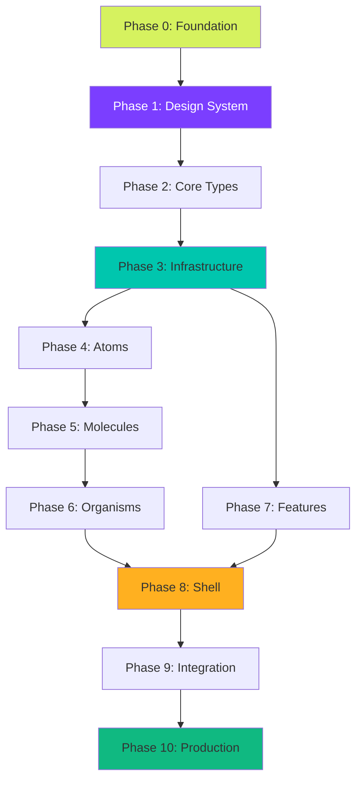

# Master Execution Plan for LimeAura Codebase Development

## Strategic Overview

This master plan orchestrates the complete development of the LimeAura productivity suite through 10 carefully sequenced phases. Each phase is designed to be executed independently by an AI coding agent, with clear deliverables, validation criteria, and integration points.

### Execution Principles

1. **Incremental Delivery**: Each phase produces working, testable code
2. **Interface-First**: Define contracts before implementation
3. **Test-Driven**: Every component includes tests
4. **Documentation-Complete**: Code is self-documenting with inline comments
5. **Validation-Ready**: Clear checklist for automated validation

### Phase Dependencies Map



---

## Phase 0: Foundation & Configuration
**Duration**: 2 days | **Dependencies**: None | **Priority**: Critical

### Objectives
- Initialize monorepo structure
- Configure development environment
- Set up tooling and dependencies

### Files to Create

#### 0.1 `/package.json`
**Purpose**: Root workspace configuration
**Interface**: pnpm workspace management
```json
{
  "name": "limeaura",
  "private": true,
  "workspaces": ["packages/*", "apps/*"],
  "scripts": {
    "dev": "turbo dev",
    "build": "turbo build",
    "test": "turbo test"
  }
}
```
**Validation Checklist**:
- [ ] Valid JSON syntax
- [ ] Includes all workspace paths
- [ ] Scripts for dev, build, test, lint
- [ ] Correct dependency versions
- [ ] Engine requirements specified

#### 0.2 `/pnpm-workspace.yaml`
**Purpose**: PNPM workspace configuration
**Interface**: Package management
```yaml
packages:
  - 'packages/*'
  - 'apps/*'
```
**Validation Checklist**:
- [ ] Valid YAML syntax
- [ ] Correct package paths
- [ ] Matches package.json workspaces

#### 0.3 `/turbo.json`
**Purpose**: Turborepo build configuration
**Interface**: Task orchestration
```json
{
  "$schema": "https://turbo.build/schema.json",
  "pipeline": {
    "build": {
      "dependsOn": ["^build"],
      "outputs": ["dist/**"]
    }
  }
}
```
**Validation Checklist**:
- [ ] Valid schema reference
- [ ] Pipeline tasks defined
- [ ] Caching strategy configured
- [ ] Output directories specified

#### 0.4 `/.env.example`
**Purpose**: Environment variables template
**Interface**: Configuration contract
**Validation Checklist**:
- [ ] All required variables documented
- [ ] Descriptions for each variable
- [ ] No sensitive data included
- [ ] Proper formatting

#### 0.5 `/tsconfig.base.json`
**Purpose**: Shared TypeScript configuration
**Interface**: Type checking rules
**Validation Checklist**:
- [ ] Strict mode enabled
- [ ] Path mappings configured
- [ ] Target ES2022 or later
- [ ] Module resolution configured

#### 0.6 `/.eslintrc.base.json`
**Purpose**: Shared linting rules
**Interface**: Code quality standards
**Validation Checklist**:
- [ ] Extends recommended configs
- [ ] React/Hooks rules included
- [ ] TypeScript rules configured
- [ ] Accessibility rules enabled

#### 0.7 `/.prettierrc`
**Purpose**: Code formatting configuration
**Interface**: Formatting standards
**Validation Checklist**:
- [ ] Consistent with ESLint
- [ ] Semi-colons decision
- [ ] Quote style defined
- [ ] Line width specified

#### 0.8 `/.gitignore`
**Purpose**: Git ignore patterns
**Interface**: Version control
**Validation Checklist**:
- [ ] Node_modules ignored
- [ ] Build outputs ignored
- [ ] Environment files ignored
- [ ] IDE files ignored

#### 0.9 `/docker-compose.yml`
**Purpose**: Local development services
**Interface**: Container orchestration
**Validation Checklist**:
- [ ] PostgreSQL service configured
- [ ] Redis service configured
- [ ] Volumes for persistence
- [ ] Network configuration

#### 0.10 `/.github/workflows/ci.yml`
**Purpose**: Continuous integration pipeline
**Interface**: GitHub Actions
**Validation Checklist**:
- [ ] Triggers configured
- [ ] Node version specified
- [ ] Test job defined
- [ ] Build job defined
- [ ] Caching configured

---

## Phase 1: Design System Implementation
**Duration**: 3 days | **Dependencies**: Phase 0 | **Priority**: Critical

### Objectives
- Implement token pipeline
- Create CSS framework
- Establish design system foundation

### Files to Create

#### 1.1 `/packages/design-tokens/src/tokens.json`
**Purpose**: Design system source of truth
**Interface**: Token definitions
**Validation Checklist**:
- [ ] All color tokens defined
- [ ] Typography scale complete
- [ ] Spacing scale defined
- [ ] Animation tokens included
- [ ] Shadow definitions present

#### 1.2 `/packages/design-tokens/scripts/build.ts`
**Purpose**: Token transformation pipeline
**Interface**: Build script
```typescript
export function buildTokens(source: string): {
  css: string;
  typescript: string;
  json: string;
}
```
**Validation Checklist**:
- [ ] Reads source JSON
- [ ] Generates CSS variables
- [ ] Generates TypeScript types
- [ ] Handles token references
- [ ] Validates required tokens

#### 1.3 `/packages/design-tokens/dist/tokens.css`
**Purpose**: CSS custom properties
**Interface**: CSS variables
**Validation Checklist**:
- [ ] All tokens as CSS vars
- [ ] Proper naming convention
- [ ] No unresolved references
- [ ] Media query variants

#### 1.4 `/packages/design-tokens/dist/tokens.ts`
**Purpose**: TypeScript token exports
**Interface**: Type-safe tokens
```typescript
export const tokens: TokenMap;
export function getToken(path: string): string;
export function getCSSVar(path: string): string;
```
**Validation Checklist**:
- [ ] Exports tokens object
- [ ] Type definitions included
- [ ] Helper functions exported
- [ ] No type errors

#### 1.5 `/packages/ui/src/styles/reset.css`
**Purpose**: CSS reset/normalize
**Interface**: Global styles
**Validation Checklist**:
- [ ] Box-sizing border-box
- [ ] Margin/padding reset
- [ ] Font smoothing
- [ ] Focus styles preserved

#### 1.6 `/packages/ui/src/styles/animations.css`
**Purpose**: Keyframe animations
**Interface**: Animation library
**Validation Checklist**:
- [ ] fadeInUp defined
- [ ] slideIn variants
- [ ] Pulse animations
- [ ] Performance optimized

#### 1.7 `/packages/ui/src/styles/utilities.css`
**Purpose**: Utility classes
**Interface**: CSS utilities
**Validation Checklist**:
- [ ] Display utilities
- [ ] Spacing utilities
- [ ] Typography utilities
- [ ] Responsive variants

#### 1.8 `/packages/ui/src/utils/AnimationOrchestrator.ts`
**Purpose**: Animation performance management
**Interface**: Animation controller
```typescript
export class AnimationOrchestrator {
  scheduleAnimation(element: HTMLElement, options: AnimationOptions): void;
  getCapabilities(): DeviceCapabilities;
}
```
**Validation Checklist**:
- [ ] Device detection works
- [ ] Stagger system functional
- [ ] Intersection observer integrated
- [ ] Performance monitoring active
- [ ] Reduced motion respected

#### 1.9 `/packages/ui/src/utils/DeviceCapabilities.ts`
**Purpose**: Hardware capability detection
**Interface**: Performance detection
```typescript
export function detectCapabilities(): DeviceCapabilities;
export function shouldReduceAnimations(): boolean;
```
**Validation Checklist**:
- [ ] GPU detection works
- [ ] Memory detection works
- [ ] CPU core detection
- [ ] Network speed check
- [ ] Returns tier rating

#### 1.10 `/packages/design-tokens/tests/tokens.test.ts`
**Purpose**: Token validation tests
**Interface**: Test suite
**Validation Checklist**:
- [ ] Tests token generation
- [ ] Tests reference resolution
- [ ] Tests contrast ratios
- [ ] 100% coverage

---

## Phase 2: Core Types & Contracts
**Duration**: 2 days | **Dependencies**: Phase 1 | **Priority**: Critical

### Objectives
- Define all TypeScript interfaces
- Establish API contracts
- Create shared types package

### Files to Create

#### 2.1 `/packages/types/src/models/user.ts`
**Purpose**: User model types
**Interface**: User interfaces
```typescript
export interface User {
  id: string;
  email: string;
  name: string;
}
export interface UserProfile extends User {
  preferences: UserPreferences;
}
```
**Validation Checklist**:
- [ ] All fields typed
- [ ] Optional fields marked
- [ ] Enums for status
- [ ] No any types

#### 2.2 `/packages/types/src/models/task.ts`
**Purpose**: Task model types
**Interface**: Task interfaces
```typescript
export interface Task {
  id: string;
  title: string;
  status: TaskStatus;
}
export interface CreateTaskDTO {
  title: string;
  projectId: string;
}
```
**Validation Checklist**:
- [ ] Complete task model
- [ ] DTO interfaces
- [ ] Status enum
- [ ] Priority enum

#### 2.3 `/packages/types/src/models/project.ts`
**Purpose**: Project model types
**Interface**: Project interfaces
**Validation Checklist**:
- [ ] Project interface complete
- [ ] Project member types
- [ ] Project status enum
- [ ] Settings interface

#### 2.4 `/packages/types/src/api/requests.ts`
**Purpose**: API request types
**Interface**: Request contracts
```typescript
export interface PaginationParams {
  page: number;
  limit: number;
}
export interface FilterParams {
  status?: string[];
  assignee?: string;
}
```
**Validation Checklist**:
- [ ] Pagination types
- [ ] Filter types
- [ ] Sort types
- [ ] Query param types

#### 2.5 `/packages/types/src/api/responses.ts`
**Purpose**: API response types
**Interface**: Response contracts
```typescript
export interface ApiResponse<T> {
  data: T;
  meta?: ResponseMeta;
}
export interface ErrorResponse {
  error: ApiError;
}
```
**Validation Checklist**:
- [ ] Success response type
- [ ] Error response type
- [ ] Pagination meta type
- [ ] Generic wrapper types

#### 2.6 `/packages/types/src/events/index.ts`
**Purpose**: Event type definitions
**Interface**: Event contracts
```typescript
export interface TaskCreatedEvent {
  type: 'task.created';
  payload: Task;
}
```
**Validation Checklist**:
- [ ] WebSocket events typed
- [ ] Event payload types
- [ ] Event type union
- [ ] Subscription types

#### 2.7 `/packages/types/src/sync/index.ts`
**Purpose**: Sync operation types
**Interface**: Offline sync contracts
```typescript
export interface SyncOperation {
  id: string;
  type: 'CREATE' | 'UPDATE' | 'DELETE';
  entity: string;
  data: unknown;
}
```
**Validation Checklist**:
- [ ] Operation types defined
- [ ] Conflict types defined
- [ ] Version vector types
- [ ] Sync state enum

#### 2.8 `/packages/types/src/ui/components.ts`
**Purpose**: Component prop types
**Interface**: UI contracts
```typescript
export interface ButtonProps {
  variant?: 'primary' | 'secondary';
  size?: 'sm' | 'md' | 'lg';
}
```
**Validation Checklist**:
- [ ] Common prop types
- [ ] Variant types
- [ ] Size scales
- [ ] Event handler types

#### 2.9 `/packages/types/src/index.ts`
**Purpose**: Main type exports
**Interface**: Public API
**Validation Checklist**:
- [ ] All types exported
- [ ] Organized exports
- [ ] No circular deps
- [ ] Documentation complete

#### 2.10 `/packages/types/package.json`
**Purpose**: Package configuration
**Interface**: NPM package
**Validation Checklist**:
- [ ] Name and version
- [ ] Main/types fields
- [ ] Build script
- [ ] No dependencies

---

## Phase 3: Infrastructure Services
**Duration**: 5 days | **Dependencies**: Phase 2 | **Priority**: Critical

### Objectives
- Implement core services
- Set up API client
- Create offline store
- Implement auth system

### Files to Create

#### 3.1 `/packages/api-client/src/client.ts`
**Purpose**: HTTP API client
**Interface**: API service
```typescript
export class ApiClient {
  get<T>(path: string, params?: any): Promise<T>;
  post<T>(path: string, data: any): Promise<T>;
  patch<T>(path: string, data: any): Promise<T>;
  delete(path: string): Promise<void>;
}
```
**Validation Checklist**:
- [ ] All HTTP methods
- [ ] Error handling
- [ ] Request interceptors
- [ ] Response interceptors
- [ ] Retry logic
- [ ] Type safety

#### 3.2 `/packages/api-client/src/interceptors.ts`
**Purpose**: Request/response interceptors
**Interface**: Middleware
```typescript
export function authInterceptor(config: RequestConfig): RequestConfig;
export function errorInterceptor(error: ApiError): Promise<never>;
```
**Validation Checklist**:
- [ ] Auth token injection
- [ ] Error transformation
- [ ] Retry logic
- [ ] Logging

#### 3.3 `/packages/websocket/src/client.ts`
**Purpose**: WebSocket client
**Interface**: Real-time service
```typescript
export class WebSocketClient {
  connect(url: string): Promise<void>;
  subscribe(channel: string, handler: Function): () => void;
  emit(event: string, data: any): void;
}
```
**Validation Checklist**:
- [ ] Connection management
- [ ] Auto-reconnect
- [ ] Event emitter
- [ ] Channel subscriptions
- [ ] Error handling
- [ ] Heartbeat

#### 3.4 `/packages/offline-store/src/store.ts`
**Purpose**: IndexedDB offline store
**Interface**: Offline persistence
```typescript
export class OfflineStore {
  async save(entity: string, data: any): Promise<void>;
  async get(entity: string, id: string): Promise<any>;
  async sync(): Promise<SyncResult>;
}
```
**Validation Checklist**:
- [ ] IndexedDB setup
- [ ] CRUD operations
- [ ] Sync queue
- [ ] Conflict resolution
- [ ] Version tracking

#### 3.5 `/packages/offline-store/src/sync-engine.ts`
**Purpose**: Synchronization engine
**Interface**: Sync orchestration
```typescript
export class SyncEngine {
  async sync(): Promise<SyncResult>;
  resolveConflict(local: any, remote: any): any;
}
```
**Validation Checklist**:
- [ ] Sync algorithm
- [ ] Conflict detection
- [ ] Resolution strategies
- [ ] Retry mechanism
- [ ] Progress tracking

#### 3.6 `/packages/auth/src/auth-service.ts`
**Purpose**: Authentication service
**Interface**: Auth management
```typescript
export class AuthService {
  async login(credentials: LoginDTO): Promise<AuthTokens>;
  async refresh(): Promise<AuthTokens>;
  logout(): void;
  getUser(): User | null;
}
```
**Validation Checklist**:
- [ ] Login flow
- [ ] Token management
- [ ] Refresh logic
- [ ] User state
- [ ] Logout cleanup
- [ ] OAuth support

#### 3.7 `/packages/auth/src/guards.ts`
**Purpose**: Route protection
**Interface**: Auth guards
```typescript
export function requireAuth(Component: React.FC): React.FC;
export function requireRole(role: string): HOC;
```
**Validation Checklist**:
- [ ] Auth check
- [ ] Role validation
- [ ] Redirect logic
- [ ] Loading state

#### 3.8 `/packages/state/src/stores/app.store.ts`
**Purpose**: Global app state
**Interface**: State management
```typescript
export const useAppStore = create<AppState>((set) => ({
  theme: 'light',
  setTheme: (theme) => set({ theme })
}));
```
**Validation Checklist**:
- [ ] Zustand setup
- [ ] State interface
- [ ] Actions defined
- [ ] Persistence configured
- [ ] DevTools enabled

#### 3.9 `/packages/state/src/stores/user.store.ts`
**Purpose**: User state management
**Interface**: User store
**Validation Checklist**:
- [ ] User state
- [ ] Preferences
- [ ] Update actions
- [ ] Reset action

#### 3.10 `/packages/analytics/src/tracker.ts`
**Purpose**: Analytics tracking
**Interface**: Event tracking
```typescript
export function track(event: string, properties?: any): void;
export function identify(userId: string, traits?: any): void;
```
**Validation Checklist**:
- [ ] Event tracking
- [ ] User identification
- [ ] Page tracking
- [ ] Error tracking
- [ ] Performance metrics

---

## Phase 4: Atomic Components
**Duration**: 4 days | **Dependencies**: Phase 3 | **Priority**: High

### Objectives
- Build foundational UI components
- Implement design system atoms
- Create Storybook stories

### Files to Create

#### 4.1 `/packages/ui/src/components/Button/Button.tsx`
**Purpose**: Button component
**Interface**: Interactive element
```typescript
export interface ButtonProps {
  variant?: 'primary' | 'secondary' | 'ghost';
  size?: 'sm' | 'md' | 'lg';
  onClick?: () => void;
}
export const Button: React.FC<ButtonProps>;
```
**Validation Checklist**:
- [ ] All variants styled
- [ ] Size variations
- [ ] Loading state
- [ ] Disabled state
- [ ] Icon support
- [ ] Keyboard accessible
- [ ] ARIA attributes

#### 4.2 `/packages/ui/src/components/Button/Button.test.tsx`
**Purpose**: Button tests
**Interface**: Test suite
**Validation Checklist**:
- [ ] Renders correctly
- [ ] Click handler fires
- [ ] Disabled prevents click
- [ ] Keyboard navigation
- [ ] Accessibility tests

#### 4.3 `/packages/ui/src/components/Button/Button.stories.tsx`
**Purpose**: Button stories
**Interface**: Storybook stories
**Validation Checklist**:
- [ ] All variants shown
- [ ] Interactive controls
- [ ] Documentation
- [ ] Accessibility panel

#### 4.4 `/packages/ui/src/components/Input/Input.tsx`
**Purpose**: Input component
**Interface**: Form control
```typescript
export interface InputProps {
  type?: 'text' | 'email' | 'password';
  error?: string;
  label?: string;
}
```
**Validation Checklist**:
- [ ] Input types supported
- [ ] Error states
- [ ] Label integration
- [ ] Placeholder support
- [ ] Validation display
- [ ] Focus management

#### 4.5 `/packages/ui/src/components/Avatar/Avatar.tsx`
**Purpose**: Avatar component
**Interface**: User representation
```typescript
export interface AvatarProps {
  src?: string;
  name: string;
  size?: 'sm' | 'md' | 'lg';
}
```
**Validation Checklist**:
- [ ] Image rendering
- [ ] Fallback initials
- [ ] Size variants
- [ ] Group support
- [ ] Online indicator

#### 4.6 `/packages/ui/src/components/Badge/Badge.tsx`
**Purpose**: Badge component
**Interface**: Status indicator
**Validation Checklist**:
- [ ] Color variants
- [ ] Size options
- [ ] Dot variant
- [ ] Removable option
- [ ] Animation

#### 4.7 `/packages/ui/src/components/Icon/Icon.tsx`
**Purpose**: Icon component
**Interface**: SVG wrapper
```typescript
export interface IconProps {
  name: IconName;
  size?: number;
  color?: string;
}
```
**Validation Checklist**:
- [ ] Icon library integrated
- [ ] Size control
- [ ] Color control
- [ ] Accessibility labels

#### 4.8 `/packages/ui/src/components/Spinner/Spinner.tsx`
**Purpose**: Loading spinner
**Interface**: Loading indicator
**Validation Checklist**:
- [ ] Size variants
- [ ] Color options
- [ ] Accessibility
- [ ] Smooth animation

#### 4.9 `/packages/ui/src/components/Toggle/Toggle.tsx`
**Purpose**: Toggle switch
**Interface**: Boolean control
```typescript
export interface ToggleProps {
  checked: boolean;
  onChange: (checked: boolean) => void;
  label?: string;
}
```
**Validation Checklist**:
- [ ] Toggle animation
- [ ] Keyboard control
- [ ] Label association
- [ ] Disabled state

#### 4.10 `/packages/ui/src/components/Tooltip/Tooltip.tsx`
**Purpose**: Tooltip component
**Interface**: Contextual info
**Validation Checklist**:
- [ ] Positioning logic
- [ ] Arrow display
- [ ] Hover/focus trigger
- [ ] Content wrapping
- [ ] Z-index management

---

## Phase 5: Molecular Components
**Duration**: 4 days | **Dependencies**: Phase 4 | **Priority**: High

### Objectives
- Build composite components
- Create reusable UI patterns
- Implement complex interactions

### Files to Create

#### 5.1 `/packages/ui/src/components/Card/Card.tsx`
**Purpose**: Card container
**Interface**: Content container
```typescript
export interface CardProps {
  variant?: 'default' | 'hero' | 'compact';
  hoverable?: boolean;
  onClick?: () => void;
}
```
**Validation Checklist**:
- [ ] Variants implemented
- [ ] Shadow styles
- [ ] Hover effects
- [ ] Animation orchestration
- [ ] Cutout variant
- [ ] Click handling

#### 5.2 `/packages/ui/src/components/Modal/Modal.tsx`
**Purpose**: Modal dialog
**Interface**: Overlay component
```typescript
export interface ModalProps {
  isOpen: boolean;
  onClose: () => void;
  title?: string;
  size?: 'sm' | 'md' | 'lg';
}
```
**Validation Checklist**:
- [ ] Portal rendering
- [ ] Backdrop click
- [ ] Escape key handling
- [ ] Focus trap
- [ ] Animation
- [ ] Scrolling behavior

#### 5.3 `/packages/ui/src/components/Dropdown/Dropdown.tsx`
**Purpose**: Dropdown menu
**Interface**: Selection control
**Validation Checklist**:
- [ ] Positioning logic
- [ ] Keyboard navigation
- [ ] Click outside
- [ ] Multi-select option
- [ ] Search/filter

#### 5.4 `/packages/ui/src/components/ProgressCircular/ProgressCircular.tsx`
**Purpose**: Circular progress
**Interface**: Progress indicator
```typescript
export interface ProgressCircularProps {
  value: number;
  size?: number;
  showLabel?: boolean;
}
```
**Validation Checklist**:
- [ ] SVG rendering
- [ ] Percentage calculation
- [ ] Animation
- [ ] Color variants
- [ ] Label display

#### 5.5 `/packages/ui/src/components/TaskItem/TaskItem.tsx`
**Purpose**: Task list item
**Interface**: Task display
```typescript
export interface TaskItemProps {
  task: Task;
  onStatusChange?: (status: TaskStatus) => void;
  draggable?: boolean;
}
```
**Validation Checklist**:
- [ ] Task rendering
- [ ] Status indicator
- [ ] Priority badge
- [ ] Assignee avatar
- [ ] Due date display
- [ ] Drag handle

#### 5.6 `/packages/ui/src/components/NotificationItem/NotificationItem.tsx`
**Purpose**: Notification display
**Interface**: Alert component
**Validation Checklist**:
- [ ] Type variants
- [ ] Action buttons
- [ ] Dismiss animation
- [ ] Read/unread state
- [ ] Avatar display

#### 5.7 `/packages/ui/src/components/SearchInput/SearchInput.tsx`
**Purpose**: Search input
**Interface**: Search control
**Validation Checklist**:
- [ ] Search icon
- [ ] Clear button
- [ ] Loading state
- [ ] Suggestions dropdown
- [ ] Debouncing

#### 5.8 `/packages/ui/src/components/DatePicker/DatePicker.tsx`
**Purpose**: Date selection
**Interface**: Date control
**Validation Checklist**:
- [ ] Calendar popup
- [ ] Date formatting
- [ ] Range selection
- [ ] Disabled dates
- [ ] Keyboard navigation

#### 5.9 `/packages/ui/src/components/TagInput/TagInput.tsx`
**Purpose**: Tag input
**Interface**: Multi-value input
**Validation Checklist**:
- [ ] Tag creation
- [ ] Tag removal
- [ ] Autocomplete
- [ ] Validation
- [ ] Keyboard control

#### 5.10 `/packages/ui/src/components/FileUpload/FileUpload.tsx`
**Purpose**: File upload
**Interface**: Upload control
**Validation Checklist**:
- [ ] Drag and drop
- [ ] File preview
- [ ] Progress display
- [ ] Error handling
- [ ] Multiple files

---

## Phase 6: Organism Components
**Duration**: 5 days | **Dependencies**: Phase 5 | **Priority**: High

### Objectives
- Build complex UI components
- Implement business logic
- Create feature-rich interfaces

### Files to Create

#### 6.1 `/packages/ui/src/components/KanbanBoard/KanbanBoard.tsx`
**Purpose**: Kanban board view
**Interface**: Task board
```typescript
export interface KanbanBoardProps {
  columns: KanbanColumn[];
  onTaskMove?: (taskId: string, columnId: string) => void;
}
```
**Validation Checklist**:
- [ ] Column rendering
- [ ] Drag and drop
- [ ] WIP limits
- [ ] Swimlanes
- [ ] Add task button
- [ ] Column customization
- [ ] Scroll handling
- [ ] Performance optimization

#### 6.2 `/packages/ui/src/components/Calendar/Calendar.tsx`
**Purpose**: Calendar view
**Interface**: Date grid
```typescript
export interface CalendarProps {
  view: 'month' | 'week' | 'day';
  events: CalendarEvent[];
  onDateSelect?: (date: Date) => void;
}
```
**Validation Checklist**:
- [ ] Month/week/day views
- [ ] Event rendering
- [ ] Navigation controls
- [ ] Today highlight
- [ ] Event creation
- [ ] Drag to reschedule
- [ ] Responsive design

#### 6.3 `/packages/ui/src/components/GanttChart/GanttChart.tsx`
**Purpose**: Gantt timeline
**Interface**: Timeline view
**Validation Checklist**:
- [ ] Timeline rendering
- [ ] Task bars
- [ ] Dependencies
- [ ] Milestones
- [ ] Zoom controls
- [ ] Drag to resize
- [ ] Critical path

#### 6.4 `/packages/ui/src/components/Dashboard/Dashboard.tsx`
**Purpose**: Dashboard container
**Interface**: Widget container
```typescript
export interface DashboardProps {
  widgets: Widget[];
  layout?: LayoutConfig;
  editable?: boolean;
}
```
**Validation Checklist**:
- [ ] Widget grid
- [ ] Drag to reorder
- [ ] Resize widgets
- [ ] Add/remove widgets
- [ ] Save layout
- [ ] Responsive grid

#### 6.5 `/packages/ui/src/components/TaskForm/TaskForm.tsx`
**Purpose**: Task creation/edit form
**Interface**: Form component
**Validation Checklist**:
- [ ] Field validation
- [ ] Rich text editor
- [ ] File attachments
- [ ] Assignee selector
- [ ] Due date picker
- [ ] Priority selector
- [ ] Submit handling

#### 6.6 `/packages/ui/src/components/CommentThread/CommentThread.tsx`
**Purpose**: Comment thread
**Interface**: Discussion component
**Validation Checklist**:
- [ ] Comment list
- [ ] Reply functionality
- [ ] Edit/delete
- [ ] Mentions
- [ ] Reactions
- [ ] Real-time updates

#### 6.7 `/packages/ui/src/components/ProjectSidebar/ProjectSidebar.tsx`
**Purpose**: Project navigation
**Interface**: Navigation component
**Validation Checklist**:
- [ ] Project list
- [ ] Collapsible sections
- [ ] Active state
- [ ] Quick actions
- [ ] Search/filter

#### 6.8 `/packages/ui/src/components/NotificationCenter/NotificationCenter.tsx`
**Purpose**: Notification panel
**Interface**: Alert center
**Validation Checklist**:
- [ ] Notification list
- [ ] Mark as read
- [ ] Filter by type
- [ ] Clear all
- [ ] Real-time updates

#### 6.9 `/packages/ui/src/components/UserMenu/UserMenu.tsx`
**Purpose**: User dropdown menu
**Interface**: User controls
**Validation Checklist**:
- [ ] Profile info
- [ ] Settings link
- [ ] Theme toggle
- [ ] Logout action
- [ ] Status indicator

#### 6.10 `/packages/ui/src/components/CommandPalette/CommandPalette.tsx`
**Purpose**: Command palette
**Interface**: Quick actions
**Validation Checklist**:
- [ ] Keyboard shortcut
- [ ] Fuzzy search
- [ ] Action categories
- [ ] Recent items
- [ ] Navigation

---

## Phase 7: Feature Modules
**Duration**: 6 days | **Dependencies**: Phase 6 | **Priority**: High

### Objectives
- Implement business features
- Create feature-specific logic
- Build complete workflows

### Files to Create

#### 7.1 `/apps/web/src/features/auth/pages/LoginPage.tsx`
**Purpose**: Login page
**Interface**: Authentication UI
**Validation Checklist**:
- [ ] Login form
- [ ] Validation
- [ ] OAuth buttons
- [ ] Remember me
- [ ] Forgot password
- [ ] Loading states
- [ ] Error display

#### 7.2 `/apps/web/src/features/auth/hooks/useAuth.ts`
**Purpose**: Auth hook
**Interface**: Auth utilities
```typescript
export function useAuth() {
  return {
    user: User | null,
    login: (credentials) => Promise<void>,
    logout: () => void,
    isLoading: boolean
  }
}
```
**Validation Checklist**:
- [ ] User state
- [ ] Login method
- [ ] Logout method
- [ ] Loading state
- [ ] Error handling

#### 7.3 `/apps/web/src/features/tasks/pages/TasksPage.tsx`
**Purpose**: Tasks listing page
**Interface**: Task management UI
**Validation Checklist**:
- [ ] Task list/board
- [ ] Filters
- [ ] Sorting
- [ ] Search
- [ ] Bulk actions
- [ ] View switcher

#### 7.4 `/apps/web/src/features/tasks/hooks/useTasks.ts`
**Purpose**: Tasks data hook
**Interface**: Task data management
**Validation Checklist**:
- [ ] Fetch tasks
- [ ] Create task
- [ ] Update task
- [ ] Delete task
- [ ] Optimistic updates
- [ ] Cache management

#### 7.5 `/apps/web/src/features/projects/pages/ProjectPage.tsx`
**Purpose**: Project detail page
**Interface**: Project view
**Validation Checklist**:
- [ ] Project header
- [ ] Tab navigation
- [ ] Task board
- [ ] Team members
- [ ] Settings panel

#### 7.6 `/apps/web/src/features/projects/components/ProjectCard.tsx`
**Purpose**: Project card
**Interface**: Project preview
**Validation Checklist**:
- [ ] Project info
- [ ] Progress bar
- [ ] Team avatars
- [ ] Quick actions
- [ ] Status indicator

#### 7.7 `/apps/web/src/features/dashboard/pages/DashboardPage.tsx`
**Purpose**: Main dashboard
**Interface**: Overview page
**Validation Checklist**:
- [ ] Widget grid
- [ ] Stats cards
- [ ] Recent activity
- [ ] Quick actions
- [ ] Notifications

#### 7.8 `/apps/web/src/features/dashboard/widgets/TasksWidget.tsx`
**Purpose**: Tasks dashboard widget
**Interface**: Task summary
**Validation Checklist**:
- [ ] Task count
- [ ] Status breakdown
- [ ] Mini chart
- [ ] View more link

#### 7.9 `/apps/web/src/features/settings/pages/SettingsPage.tsx`
**Purpose**: Settings page
**Interface**: Configuration UI
**Validation Checklist**:
- [ ] Settings tabs
- [ ] Profile form
- [ ] Preferences
- [ ] Integrations
- [ ] Save handling

#### 7.10 `/apps/web/src/features/search/components/GlobalSearch.tsx`
**Purpose**: Global search
**Interface**: Search interface
**Validation Checklist**:
- [ ] Search input
- [ ] Results dropdown
- [ ] Categories
- [ ] Recent searches
- [ ] Keyboard nav

---

## Phase 8: Application Shell
**Duration**: 3 days | **Dependencies**: Phase 7 | **Priority**: Critical

### Objectives
- Build app structure
- Implement routing
- Set up global state

### Files to Create

#### 8.1 `/apps/web/src/App.tsx`
**Purpose**: Root application
**Interface**: Main component
```typescript
export function App(): JSX.Element {
  return (
    <Providers>
      <Router>
        <Layout>
          <Routes />
        </Layout>
      </Router>
    </Providers>
  );
}
```
**Validation Checklist**:
- [ ] Provider setup
- [ ] Router configuration
- [ ] Layout wrapper
- [ ] Error boundary
- [ ] Suspense boundaries

#### 8.2 `/apps/web/src/routes/index.tsx`
**Purpose**: Route definitions
**Interface**: Routing config
**Validation Checklist**:
- [ ] All routes defined
- [ ] Lazy loading
- [ ] Route guards
- [ ] 404 handling
- [ ] Nested routes

#### 8.3 `/apps/web/src/layouts/AppLayout.tsx`
**Purpose**: Main layout
**Interface**: Layout wrapper
**Validation Checklist**:
- [ ] Header
- [ ] Sidebar
- [ ] Main content
- [ ] Responsive
- [ ] Theme support

#### 8.4 `/apps/web/src/providers/AppProviders.tsx`
**Purpose**: Context providers
**Interface**: Provider tree
**Validation Checklist**:
- [ ] Auth provider
- [ ] Theme provider
- [ ] Query client
- [ ] Error boundary
- [ ] Toast provider

#### 8.5 `/apps/web/src/hooks/useAppInit.ts`
**Purpose**: App initialization
**Interface**: Init hook
**Validation Checklist**:
- [ ] Load user
- [ ] Load preferences
- [ ] Setup listeners
- [ ] Check auth
- [ ] Load config

#### 8.6 `/apps/web/src/utils/router.ts`
**Purpose**: Router utilities
**Interface**: Navigation helpers
**Validation Checklist**:
- [ ] Route builder
- [ ] Query params
- [ ] Navigation guards
- [ ] Breadcrumbs

#### 8.7 `/apps/web/src/services/notification-service.ts`
**Purpose**: Notification handling
**Interface**: Alert service
**Validation Checklist**:
- [ ] Show notification
- [ ] Queue system
- [ ] Persistence
- [ ] Sound alerts
- [ ] Permission check

#### 8.8 `/apps/web/src/services/theme-service.ts`
**Purpose**: Theme management
**Interface**: Theme control
**Validation Checklist**:
- [ ] Theme switching
- [ ] Persistence
- [ ] System preference
- [ ] Custom themes

#### 8.9 `/apps/web/src/main.tsx`
**Purpose**: App entry point
**Interface**: Bootstrap
**Validation Checklist**:
- [ ] React render
- [ ] Service worker
- [ ] Error handling
- [ ] Performance monitoring

#### 8.10 `/apps/web/index.html`
**Purpose**: HTML template
**Interface**: Document root
**Validation Checklist**:
- [ ] Meta tags
- [ ] Font preload
- [ ] Favicon
- [ ] PWA manifest
- [ ] CSP headers

---

## Phase 9: Integration & Polish
**Duration**: 4 days | **Dependencies**: Phase 8 | **Priority**: Critical

### Objectives
- Integrate all components
- Performance optimization
- Cross-browser testing
- Accessibility audit

### Files to Create

#### 9.1 `/apps/web/src/pages/HomePage.tsx`
**Purpose**: Landing page
**Interface**: Entry point
**Validation Checklist**:
- [ ] Hero section
- [ ] Feature showcase
- [ ] CTA buttons
- [ ] Animation
- [ ] Responsive

#### 9.2 `/apps/web/src/sw.js`
**Purpose**: Service worker
**Interface**: PWA support
**Validation Checklist**:
- [ ] Cache strategy
- [ ] Offline fallback
- [ ] Update handling
- [ ] Push notifications
- [ ] Background sync

#### 9.3 `/apps/web/public/manifest.json`
**Purpose**: PWA manifest
**Interface**: App metadata
**Validation Checklist**:
- [ ] App name
- [ ] Icons
- [ ] Theme colors
- [ ] Display mode
- [ ] Shortcuts

#### 9.4 `/packages/ui/src/themes/index.ts`
**Purpose**: Theme definitions
**Interface**: Theme config
**Validation Checklist**:
- [ ] Light theme
- [ ] Dark theme
- [ ] Custom themes
- [ ] Token mapping

#### 9.5 `/apps/web/src/utils/performance.ts`
**Purpose**: Performance monitoring
**Interface**: Metrics collection
**Validation Checklist**:
- [ ] Web vitals
- [ ] Custom metrics
- [ ] Error tracking
- [ ] Reporting

#### 9.6 `/apps/web/src/utils/sentry.ts`
**Purpose**: Error monitoring
**Interface**: Error tracking
**Validation Checklist**:
- [ ] Sentry setup
- [ ] Error boundaries
- [ ] User context
- [ ] Release tracking

#### 9.7 `/apps/web/src/tests/integration/auth.test.ts`
**Purpose**: Auth integration tests
**Interface**: Test suite
**Validation Checklist**:
- [ ] Login flow
- [ ] Logout flow
- [ ] Token refresh
- [ ] Protected routes

#### 9.8 `/apps/web/src/tests/e2e/critical-path.spec.ts`
**Purpose**: E2E tests
**Interface**: Playwright tests
**Validation Checklist**:
- [ ] User journey
- [ ] Task creation
- [ ] Project management
- [ ] Collaboration

#### 9.9 `/apps/web/src/tests/accessibility/audit.test.ts`
**Purpose**: A11y tests
**Interface**: Accessibility audit
**Validation Checklist**:
- [ ] WCAG compliance
- [ ] Keyboard nav
- [ ] Screen reader
- [ ] Color contrast

#### 9.10 `/.github/workflows/deploy.yml`
**Purpose**: Deployment pipeline
**Interface**: CD workflow
**Validation Checklist**:
- [ ] Build step
- [ ] Test step
- [ ] Deploy step
- [ ] Rollback plan
- [ ] Notifications

---

## Phase 10: Production Readiness
**Duration**: 3 days | **Dependencies**: Phase 9 | **Priority**: Critical

### Objectives
- Production configuration
- Documentation
- Performance optimization
- Security hardening

### Files to Create

#### 10.1 `/docs/API.md`
**Purpose**: API documentation
**Interface**: Developer docs
**Validation Checklist**:
- [ ] Endpoint list
- [ ] Authentication
- [ ] Request examples
- [ ] Response examples
- [ ] Error codes

#### 10.2 `/docs/DEPLOYMENT.md`
**Purpose**: Deployment guide
**Interface**: Ops documentation
**Validation Checklist**:
- [ ] Prerequisites
- [ ] Environment setup
- [ ] Deployment steps
- [ ] Configuration
- [ ] Troubleshooting

#### 10.3 `/docs/ARCHITECTURE.md`
**Purpose**: Architecture documentation
**Interface**: Technical docs
**Validation Checklist**:
- [ ] System overview
- [ ] Component diagram
- [ ] Data flow
- [ ] Tech stack
- [ ] Design decisions

#### 10.4 `/infrastructure/docker/Dockerfile.web`
**Purpose**: Frontend container
**Interface**: Docker image
**Validation Checklist**:
- [ ] Multi-stage build
- [ ] Optimized size
- [ ] Security scanning
- [ ] Health check

#### 10.5 `/infrastructure/k8s/deployment.yaml`
**Purpose**: Kubernetes deployment
**Interface**: K8s manifest
**Validation Checklist**:
- [ ] Resource limits
- [ ] Health checks
- [ ] Auto-scaling
- [ ] Secrets management

#### 10.6 `/infrastructure/terraform/main.tf`
**Purpose**: Infrastructure as code
**Interface**: Terraform config
**Validation Checklist**:
- [ ] VPC setup
- [ ] Database
- [ ] Load balancer
- [ ] CDN
- [ ] Monitoring

#### 10.7 `/scripts/backup.sh`
**Purpose**: Backup script
**Interface**: Data backup
**Validation Checklist**:
- [ ] Database backup
- [ ] File backup
- [ ] Encryption
- [ ] Rotation
- [ ] Verification

#### 10.8 `/scripts/health-check.sh`
**Purpose**: Health monitoring
**Interface**: System health
**Validation Checklist**:
- [ ] API health
- [ ] Database health
- [ ] Redis health
- [ ] Disk space
- [ ] Memory usage

#### 10.9 `/SECURITY.md`
**Purpose**: Security policy
**Interface**: Security docs
**Validation Checklist**:
- [ ] Vulnerability reporting
- [ ] Security measures
- [ ] Best practices
- [ ] Contact info

#### 10.10 `/CONTRIBUTING.md`
**Purpose**: Contribution guide
**Interface**: Developer guide
**Validation Checklist**:
- [ ] Setup instructions
- [ ] Code standards
- [ ] PR process
- [ ] Testing requirements
- [ ] Review process

---

## Validation Framework

### Per-File Validation

Each file must pass:
1. **Syntax Check**: Valid TypeScript/JavaScript/CSS
2. **Linting**: No ESLint errors
3. **Type Check**: No TypeScript errors
4. **Test Coverage**: Minimum 80% coverage
5. **Documentation**: JSDoc comments complete
6. **Performance**: Bundle size within limits

### Per-Phase Validation

Each phase must achieve:
1. **Completeness**: All files created
2. **Integration**: Components work together
3. **Testing**: All tests passing
4. **Documentation**: README updated
5. **Demo**: Working demonstration

### Final Validation

Complete project must pass:
1. **E2E Tests**: All critical paths work
2. **Performance**: Lighthouse score > 90
3. **Accessibility**: Zero WCAG violations
4. **Security**: No vulnerabilities
5. **Production**: Successful deployment

---

## Execution Instructions for AI Agent

### Prerequisites
1. Ensure Phase 0 is complete
2. Verify all dependencies installed
3. Database is running
4. Development environment ready

### Execution Process

For each phase:
1. **Read** phase objectives and dependencies
2. **Create** each file in order
3. **Implement** according to interface specification
4. **Validate** against checklist
5. **Test** the implementation
6. **Document** any deviations
7. **Commit** with descriptive message

### File Creation Template

```typescript
/**
 * @file [filename]
 * @purpose [purpose from plan]
 * @interface [interface description]
 * @phase [phase number]
 */

// Implementation here

// Validation: [checklist status]
```

### Error Handling

If a file fails validation:
1. Document the failure
2. Attempt to fix
3. If unable to fix, mark as blocked
4. Continue with next file
5. Report all blocks at phase end

### Progress Tracking

Maintain a progress file:
```json
{
  "phase": 1,
  "filesCompleted": 5,
  "filesTotal": 10,
  "blockers": [],
  "nextFile": "packages/ui/src/components/Button/Button.tsx"
}
```

---

## Success Criteria

### Phase Success
- All files created and validated
- Tests passing with >80% coverage
- No blocking issues
- Documentation complete

### Project Success
- All 10 phases complete
- Application runs without errors
- Performance benchmarks met
- Production deployment successful

---

## Appendix: Quick Reference

### Command Cheatsheet
```bash
# Development
pnpm dev              # Start development
pnpm test            # Run tests
pnpm build           # Build project
pnpm lint            # Check code quality

# Phase-specific
pnpm phase:1         # Run phase 1 tasks
pnpm validate:1      # Validate phase 1

# Deployment
pnpm deploy:staging  # Deploy to staging
pnpm deploy:prod     # Deploy to production
```

### File Naming Conventions
- Components: PascalCase (`Button.tsx`)
- Utilities: camelCase (`formatDate.ts`)
- Types: PascalCase with `.types.ts`
- Tests: Same name with `.test.ts`
- Stories: Same name with `.stories.ts`

### Git Commit Format
```
phase(X): [component] description

- Implemented [feature]
- Added [tests]
- Fixed [issue]
```

---

This Master Execution Plan provides a complete roadmap for building the LimeAura codebase. Each phase is self-contained, clearly defined, and validated. The AI coding agent can execute this plan systematically, ensuring consistent quality and complete implementation.
