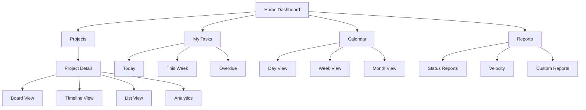

I'll create a comprehensive, updated Project Requirements Document that incorporates all our learnings and serves as the definitive reference for the LimeAura project.

<canvas>
# Project Requirements Document (PRD)
## LimeAura Productivity Suite
### Version 2.0.0 | November 2024

---

## Executive Summary

### Project Overview
LimeAura is a next-generation productivity platform that revolutionizes team collaboration through intelligent automation, delightful animations, and offline-first architecture. Built on a vibrant lime-themed design system, it delivers sub-second performance while maintaining enterprise-grade security and accessibility standards.

### Strategic Objectives
1. **Reduce task management overhead by 40%** through intelligent automation and predictive features
2. **Achieve 20% improvement in team productivity** within 6 months of adoption
3. **Deliver industry-leading performance** with sub-second interactions on 3G networks
4. **Enable seamless collaboration** across distributed teams with real-time sync and offline capabilities
5. **Set new standards for accessibility** with WCAG 2.1 AA compliance and beyond

### Key Differentiators
- **Local-first architecture** ensuring instant response times regardless of network conditions
- **Ambient intelligence** that adapts UI based on context, time, and user patterns
- **Physics-based animations** creating emotional connection while maintaining 60fps performance
- **CRDT-powered collaboration** eliminating sync conflicts in real-time editing
- **Progressive enhancement** delivering full functionality from low-end devices to high-end workstations

---

## 1. Business Requirements

### 1.1 Market Position
LimeAura targets the premium segment of project management tools, competing with Linear (performance), Notion (flexibility), and Monday.com (visual appeal) by combining their strengths while eliminating their weaknesses.

### 1.2 Target Audience

#### Primary Users
- **Product Teams** (25-100 members): Need unified view of sprints, roadmaps, and dependencies
- **Engineering Teams** (10-50 members): Require Git integration, automation, and technical workflows
- **Design Teams** (5-20 members): Value visual polish, smooth animations, and creative workflows
- **Remote-First Companies**: Demand reliable offline support and async collaboration

#### User Personas

**Sarah - Product Manager**
- Manages 3-5 concurrent projects
- Needs instant visibility into team capacity and blockers
- Values automated status reports and predictive analytics
- Pain point: Manual status collection wastes 5 hours/week

**Alex - Senior Engineer**
- Juggles 10-15 tasks across sprints
- Needs keyboard shortcuts and CLI integration
- Values performance and reliability over features
- Pain point: Context switching between tools kills flow state

**Maya - Design Lead**
- Coordinates design sprints with 8 designers
- Needs visual project views and mood boards
- Values aesthetics and smooth interactions
- Pain point: Current tools feel corporate and uninspiring

**Jordan - Startup Founder**
- Oversees 20-person distributed team
- Needs high-level dashboards and cost tracking
- Values simplicity and quick onboarding
- Pain point: Enterprise tools too complex, simple tools lack depth

### 1.3 Success Metrics

| Metric | Baseline | 3 Month Target | 6 Month Target | 12 Month Target |
|--------|----------|----------------|----------------|-----------------|
| Daily Active Users | 0 | 1,000 | 5,000 | 25,000 |
| Task Completion Rate | 65% | 75% | 80% | 85% |
| Average Session Duration | 12 min | 18 min | 22 min | 25 min |
| Team Adoption Rate | 0% | 60% | 70% | 80% |
| Status Report Time Saved | 0 hours | 2 hours/week | 3 hours/week | 4 hours/week |
| Customer Satisfaction (CSAT) | N/A | 4.2/5 | 4.4/5 | 4.6/5 |
| Revenue per User | $0 | $15/month | $20/month | $25/month |
| Churn Rate | N/A | <10% | <7% | <5% |

### 1.4 Business Constraints
- **Budget**: $2M initial development, $500K/year operations
- **Timeline**: MVP in 4 months, full launch in 8 months
- **Team Size**: 7-person core team, up to 12 by launch
- **Compliance**: GDPR, CCPA, SOC 2 Type II within year 1
- **Performance**: Must run on 2019 devices (4GB RAM, integrated graphics)

---

## 2. Functional Requirements

### 2.1 Core Features

#### 2.1.1 Task Management

**Creating Tasks**
- Natural language input with AI parsing ("Meeting with Sarah tomorrow 2pm about Q4 roadmap")
- Quick-create shortcuts (Cmd+K global hotkey)
- Bulk import from CSV, Jira, Asana, Trello
- Template library with 20+ pre-built templates
- Rich text editor with markdown support, code blocks, and embeds
- Voice-to-task creation on mobile
- Maximum task creation time: 500ms

**Task Properties**
```yaml
Required Fields:
  - Title: String (1-200 chars)
  - Project: Reference (required)
  - Creator: User (auto-populated)
  - Created: Timestamp (auto-generated)
  - Status: Enum (Backlog|Todo|In Progress|Review|Done|Cancelled)

Optional Fields:
  - Description: Rich Text (unlimited)
  - Assignee: User reference
  - Priority: Enum (Critical|High|Medium|Low)
  - Due Date: DateTime with timezone
  - Estimated Hours: Number (0.5-999)
  - Actual Hours: Number (tracked automatically)
  - Tags: Array<String> (max 10)
  - Attachments: Array<File> (max 100MB total)
  - Dependencies: Array<TaskReference>
  - Subtasks: Array<Task> (max 3 levels deep)
  - Custom Fields: JSON (org-defined schema)
  - Watchers: Array<User> (for notifications)
  - Location: GeoPoint (for field work)
  - Recurrence: RRULE (for repeating tasks)
```

**Task Operations**
- Drag-and-drop between statuses with physics animation
- Bulk operations on up to 100 tasks simultaneously
- Keyboard navigation (J/K for next/prev, X for select)
- Smart duplicate with relationship preservation
- Convert to subtask/epic with hierarchy update
- Archive with 30-day recovery window
- Permanent delete with audit trail

#### 2.1.2 Project Organization

**Workspace Hierarchy**
```
Organization
└── Workspaces (Marketing, Engineering, Design)
    └── Projects (Q4 Launch, Website Redesign)
        └── Task Groups/Epics
            └── Tasks
                └── Subtasks (max 3 levels)
```

**Project Views**
1. **Kanban Board**
   - Customizable columns (status, assignee, priority)
   - WIP limits with visual warnings
   - Swimlanes by any property
   - Card preview with key metrics
   - Column automation rules

2. **Sprint Planning**
   - 1-4 week sprint cycles
   - Capacity planning with team availability
   - Sprint velocity tracking and forecasting
   - Burndown/burnup charts with ideal line
   - Sprint retrospective templates

3. **Gantt Timeline**
   - Dependency visualization with critical path
   - Resource allocation heatmap
   - Milestone markers with progress
   - Baseline vs actual comparison
   - Zoom levels: hour to year

4. **Calendar View**
   - Day/Week/Month/Quarter views
   - Drag to reschedule with conflict detection
   - Team availability overlay
   - Holiday and event integration
   - Task density heatmap

5. **List View**
   - Grouping by any property
   - Multi-level sorting
   - Inline editing without mode switch
   - Saved view templates
   - Export to CSV/Excel

#### 2.1.3 Collaboration Features

**Real-time Collaboration**
- Presence indicators (cursor, selection, typing)
- Live activity feed with 1-second latency
- Collaborative editing with CRDT conflict resolution
- Screen sharing integration (via WebRTC)
- Shared cursors in Gantt/Board views
- "Follow me" mode for presentations

**Communication**
- Threaded comments with rich text
- @mentions with smart suggestions
- Inline task chat with history
- Video message attachments (max 2 min)
- Emoji reactions for quick feedback
- Read receipts and typing indicators

**Notifications**
- Smart notification grouping
- Customizable triggers per project/user
- Digest options (immediate, hourly, daily)
- Do Not Disturb scheduling
- Channel preferences (in-app, email, mobile, Slack)
- Notification snoozing

#### 2.1.4 Automation & Intelligence

**Smart Automation**
```javascript
// Example automation rule
{
  trigger: "task.status.changed",
  conditions: [
    { field: "status", operator: "equals", value: "Done" },
    { field: "priority", operator: "equals", value: "Critical" }
  ],
  actions: [
    { type: "notify", recipients: ["@manager", "@stakeholders"] },
    { type: "create_task", template: "follow_up_review" },
    { type: "update_field", field: "completed_at", value: "now()" }
  ]
}
```

**AI-Powered Features**
- Task effort estimation based on historical data (±20% accuracy)
- Smart assignee suggestions using skill matching
- Optimal due date calculation considering dependencies
- Risk detection for timeline/budget overruns
- Natural language search ("tasks due next week assigned to me")
- Meeting transcription to action items
- Sentiment analysis on comments for team health

#### 2.1.5 Reporting & Analytics

**Dashboard Components**
- 15+ pre-built widgets (velocity, burndown, distribution)
- Custom widget builder with SQL access
- Real-time data with 5-second refresh
- Drill-down from widget to source data
- Shareable dashboard links with permissions
- TV mode for office displays

**Reports**
- Weekly status email automation
- Sprint/Release reports with metrics
- Resource utilization by team/person
- Project health scores with trends
- Time tracking summaries with billable hours
- Custom report builder with scheduling

**Analytics**
- Cycle time and lead time tracking
- Velocity trends with forecasting
- Bottleneck identification
- Team performance metrics
- Predictive completion dates
- Monte Carlo simulations for timeline confidence

### 2.2 User Management & Permissions

#### 2.2.1 Authentication
- Email/password with strength requirements
- OAuth 2.0 (Google, GitHub, Microsoft, Slack)
- SAML 2.0 for enterprise SSO
- Multi-factor authentication (TOTP, SMS, WebAuthn)
- Passwordless login via magic links
- Biometric authentication on mobile
- Session management across devices

#### 2.2.2 Role-Based Access Control

| Role | Capabilities | Restrictions |
|------|-------------|--------------|
| **Owner** | Full system control, billing, delete org | Cannot be removed |
| **Admin** | Manage users, projects, integrations | Cannot delete org or change billing |
| **Project Lead** | Full project control, manage members | Limited to assigned projects |
| **Member** | Create/edit tasks, view reports | Cannot change project settings |
| **Guest** | View and comment only | No edit permissions, time-limited access |
| **Viewer** | Read-only access | Cannot comment or edit |

#### 2.2.3 Advanced Permissions
- Field-level permissions (hide salary, PII)
- Time-based access (contractors, temporary)
- IP restrictions for sensitive projects
- Data residency controls by region
- Export restrictions by role
- API access controls with rate limits

### 2.3 Integrations

#### 2.3.1 Development Tools
- **Git Providers**: GitHub, GitLab, Bitbucket
  - Auto-link commits to tasks
  - PR status updates
  - Branch creation from tasks
  - Deployment tracking
  
- **CI/CD**: Jenkins, GitHub Actions, CircleCI
  - Build status in task view
  - Deployment approvals
  - Rollback triggers
  - Test result integration

- **IDEs**: VS Code, JetBrains
  - Create tasks from TODOs
  - Time tracking integration
  - Code review assignments

#### 2.3.2 Communication
- **Slack**: Bi-directional sync, slash commands, unfurling
- **Microsoft Teams**: App tab, notifications, bot
- **Discord**: Webhooks, bot commands
- **Email**: Create tasks from emails, reply to notifications

#### 2.3.3 File Storage
- Google Drive, Dropbox, OneDrive, Box
- Direct file preview without download
- Version history integration
- Collaborative editing links
- Storage quota management

#### 2.3.4 Calendar
- Google Calendar, Outlook, iCal
- Two-way sync for due dates
- Meeting-task associations
- Availability checking
- Time blocking for focused work

---

## 3. Non-Functional Requirements

### 3.1 Performance Requirements

#### 3.1.1 Response Times
| Operation | Target | Maximum | Measurement Point |
|-----------|--------|---------|-------------------|
| Page Load (First Contentful Paint) | 800ms | 1500ms | 3G Network |
| Time to Interactive | 1500ms | 3000ms | 3G Network |
| Task Creation | 200ms | 500ms | UI Response |
| Search Results | 100ms | 300ms | First Result |
| View Switch | 150ms | 400ms | Complete Render |
| Data Sync | 500ms | 2000ms | Conflict Resolution |
| File Upload (10MB) | 5s | 15s | 10Mbps Connection |

#### 3.1.2 Capacity Requirements
- Concurrent users: 10,000 baseline, 50,000 peak
- WebSocket connections: 5,000 per server node
- Database transactions: 10,000 TPS
- Storage: 100GB per organization
- API calls: 1000/minute per user
- Search indexing: < 30 second lag
- Report generation: < 10 seconds for 1 year data

#### 3.1.3 Resource Constraints
```yaml
Browser Requirements:
  - Memory: Max 150MB after 1 hour
  - CPU: < 30% on 2-core processor
  - Storage: 50MB IndexedDB
  - Network: Graceful degradation to 2G

Mobile Requirements:
  - App Size: < 40MB download
  - Memory: Max 100MB active
  - Battery: < 5% drain per hour
  - Offline Storage: 200MB
```

### 3.2 Security Requirements

#### 3.2.1 Data Protection
- **Encryption at Rest**: AES-256-GCM for all stored data
- **Encryption in Transit**: TLS 1.3 minimum, perfect forward secrecy
- **Key Management**: AWS KMS or HashiCorp Vault
- **Data Tokenization**: PII replaced with tokens
- **Secure Deletion**: DoD 5220.22-M standard
- **Backup Encryption**: Separate keys from primary

#### 3.2.2 Access Control
- Zero-trust architecture with per-request validation
- JWT tokens with 15-minute expiry, refresh tokens 7 days
- API rate limiting: 1000 req/hour standard, 5000 enterprise
- Brute force protection: Account lockout after 5 attempts
- Session monitoring: Concurrent session limits
- Audit logging: All data access logged for 2 years

#### 3.2.3 Compliance
- **GDPR**: Data portability, right to deletion, consent management
- **CCPA**: California privacy rights implementation
- **SOC 2 Type II**: Annual certification required
- **ISO 27001**: Information security management
- **HIPAA**: Healthcare data handling (future)
- **PCI DSS**: Payment processing compliance

### 3.3 Reliability Requirements

#### 3.3.1 Availability
- **Uptime Target**: 99.9% monthly (43.2 minutes downtime)
- **Planned Maintenance**: < 4 hours monthly, off-peak
- **Disaster Recovery**: 1 hour RTO, 5 minute RPO
- **Geographic Redundancy**: 3 regions minimum
- **Automatic Failover**: < 30 seconds
- **Data Durability**: 99.999999999% (11 nines)

#### 3.3.2 Fault Tolerance
- Graceful degradation for non-critical features
- Circuit breakers for external services
- Retry logic with exponential backoff
- Queue-based processing for async operations
- Database read replicas for query distribution
- Cache fallbacks for service failures

### 3.4 Usability Requirements

#### 3.4.1 Accessibility
- **WCAG 2.1 Level AA** full compliance
- Screen reader support (NVDA, JAWS, VoiceOver)
- Keyboard navigation for all features
- Focus indicators meeting 3:1 contrast ratio
- Color-blind safe palettes
- Captions for video content
- Text scaling to 200% without horizontal scroll

#### 3.4.2 Internationalization
- Support for 12 initial languages
- RTL layout support (Arabic, Hebrew)
- Local date/time formats
- Currency and number formatting
- Timezone-aware scheduling
- Cultural color considerations
- Translation management system

#### 3.4.3 User Experience
- Onboarding completion in < 5 minutes
- Maximum 3 clicks to any feature
- Undo/redo for all destructive actions
- Contextual help and tooltips
- Keyboard shortcuts for power users
- Mobile-first responsive design
- Progressive disclosure for complexity

### 3.5 Compatibility Requirements

#### 3.5.1 Browser Support
| Browser | Minimum Version | Feature Set |
|---------|----------------|-------------|
| Chrome | 90+ | Full features |
| Firefox | 88+ | Full features |
| Safari | 14+ | Full features |
| Edge | 90+ | Full features |
| Mobile Safari | iOS 14+ | Core features |
| Chrome Mobile | Android 10+ | Core features |

#### 3.5.2 Device Support
- **Desktop**: Windows 10+, macOS 11+, Ubuntu 20.04+
- **Tablet**: iPad 2019+, Android tablets 2020+
- **Mobile**: iPhone 11+, Android 10+
- **Minimum Screen**: 320px width
- **Maximum Screen**: 8K displays
- **Input Methods**: Mouse, touch, stylus, keyboard

---

## 4. Technical Specifications

### 4.1 Architecture Overview

#### 4.1.1 Frontend Architecture
```typescript
// Technology Stack
{
  framework: "React 18.2",
  language: "TypeScript 5.3",
  bundler: "Vite 5.0",
  styling: "CSS Modules + PostCSS",
  state: {
    local: "Zustand 4.5",
    server: "TanStack Query 5.0",
    realtime: "Yjs 13.6"
  },
  offline: {
    storage: "IndexedDB via Dexie",
    sync: "Background Sync API",
    conflict: "CRDT (Yjs)"
  },
  testing: {
    unit: "Vitest",
    component: "React Testing Library",
    e2e: "Playwright"
  }
}
```

#### 4.1.2 Backend Architecture
```typescript
// Technology Stack
{
  runtime: "Node.js 20 LTS",
  framework: "Fastify 4.24",
  language: "TypeScript 5.3",
  database: {
    primary: "PostgreSQL 16",
    cache: "Redis 7.2",
    search: "Elasticsearch 8.11",
    timeseries: "TimescaleDB 2.13"
  },
  messaging: {
    queue: "BullMQ",
    pubsub: "Redis Streams",
    websocket: "Socket.io 4.6"
  },
  api: {
    rest: "OpenAPI 3.1",
    graphql: "Apollo Server 4.9",
    grpc: "gRPC 1.59"
  }
}
```

### 4.2 Data Models

#### 4.2.1 Core Entities
```typescript
interface Organization {
  id: UUID;
  name: string;
  slug: string;
  plan: 'free' | 'team' | 'enterprise';
  settings: {
    branding: BrandingConfig;
    security: SecurityConfig;
    features: FeatureFlags;
  };
  limits: {
    users: number;
    projects: number;
    storage: number;
    apiCalls: number;
  };
  createdAt: DateTime;
  updatedAt: DateTime;
}

interface Task {
  id: UUID;
  projectId: UUID;
  title: string;
  description: RichTextDocument;
  status: TaskStatus;
  priority: Priority;
  assignee: UUID | null;
  reporter: UUID;
  watchers: UUID[];
  tags: string[];
  customFields: Record<string, any>;
  
  // Scheduling
  startDate: DateTime | null;
  dueDate: DateTime | null;
  estimatedHours: number | null;
  actualHours: number;
  
  // Relationships
  parentId: UUID | null;
  dependencies: {
    taskId: UUID;
    type: 'blocks' | 'relates' | 'duplicates';
  }[];
  
  // Metadata
  version: number;
  createdAt: DateTime;
  updatedAt: DateTime;
  deletedAt: DateTime | null;
  
  // Computed
  isOverdue: boolean;
  progress: number;
  risk: 'low' | 'medium' | 'high';
}
```

### 4.3 API Specifications

#### 4.3.1 RESTful API
```yaml
# Task Endpoints
GET    /api/v1/tasks                 # List tasks (paginated)
POST   /api/v1/tasks                 # Create task
GET    /api/v1/tasks/:id             # Get task details
PATCH  /api/v1/tasks/:id             # Update task
DELETE /api/v1/tasks/:id             # Delete task
POST   /api/v1/tasks/:id/assign      # Assign task
POST   /api/v1/tasks/:id/comment     # Add comment
GET    /api/v1/tasks/:id/history     # Get task history
POST   /api/v1/tasks/bulk            # Bulk operations

# Query Parameters
?filter[status]=in_progress,review
?filter[assignee]=user-uuid
?filter[due_date]=2024-01-01..2024-12-31
?sort=-priority,due_date
?include=assignee,project,subtasks
?page[size]=20&page[number]=1
```

#### 4.3.2 WebSocket Events
```typescript
// Client -> Server
socket.emit('subscribe', { channel: 'project:123' });
socket.emit('task:update', { id, changes });
socket.emit('presence:update', { cursor, selection });

// Server -> Client
socket.on('task:created', (task) => {});
socket.on('task:updated', (id, changes) => {});
socket.on('task:deleted', (id) => {});
socket.on('presence:changed', (userId, state) => {});
socket.on('notification', (notification) => {});
```

### 4.4 Offline Synchronization

#### 4.4.1 Sync Protocol
```typescript
interface SyncProtocol {
  // Client maintains version vector
  clientVersion: Map<string, number>;
  
  // Sync process
  steps: [
    'detectOnline',
    'gatherLocalChanges',
    'sendChangeset',
    'receiveServerChanges',
    'resolveConflicts',
    'applyMerged',
    'updateVersions'
  ];
  
  // Conflict resolution
  conflictStrategy: {
    textFields: 'CRDT_merge',
    statusField: 'server_wins',
    numericFields: 'last_write_wins',
    assignments: 'union_merge'
  };
}
```

---

## 5. User Experience Requirements

### 5.1 Information Architecture



### 5.2 Visual Design Requirements

#### 5.2.1 Design System Adherence
- Strict compliance with `limeaura-design-system.json`
- Lime primary background (#D6F25F)
- White card surfaces with 28px border radius
- Purple accent color (#7B3EFF)
- Nunito font family throughout
- Consistent 8px spacing grid

#### 5.2.2 Animation Requirements
```yaml
Entrance Animations:
  - Cards: fadeInUp with 600ms duration
  - Stagger: 100ms between cards
  - Hero cutout: morphCutout 800ms elastic

Interaction Animations:
  - Hover: translateY(-4px) 180ms
  - Click: scale(0.98) 120ms
  - Drag: physics-based spring

Performance Constraints:
  - Max concurrent: 8 animations
  - Frame budget: 16.67ms
  - Reduced motion: respect preference
  - GPU acceleration: required
```

### 5.3 Content Requirements

#### 5.3.1 Microcopy Guidelines
- Action-oriented button labels ("Create Task" not "New")
- Positive confirmation messages ("Task created!" not "Success")
- Human-readable errors ("We couldn't save your changes" not "Error 500")
- Progressive disclosure in help text
- Contextual placeholders with examples

#### 5.3.2 Empty States
- Illustrated empty states with action prompts
- Sample data option for new users
- Import suggestions based on detected tools
- Video tutorials embedded in empty views
- Quick-start checklists

---

## 6. Development Requirements

### 6.1 Development Environment

```yaml
Required Tools:
  - Node.js: 20.x LTS
  - pnpm: 8.x
  - Docker: 24.x
  - PostgreSQL: 16.x
  - Redis: 7.x

Development Setup:
  - Hot reload: < 500ms
  - Test watch mode: automatic
  - Database seeding: scripted
  - Mock data: 1000+ records
  - Local HTTPS: mkcert
```

### 6.2 Code Quality Standards

```typescript
// Required metrics
{
  coverage: {
    statements: 80,
    branches: 75,
    functions: 80,
    lines: 80
  },
  complexity: {
    cyclomatic: 10,
    cognitive: 15
  },
  performance: {
    bundleSize: "500KB",
    chunkSize: "200KB",
    lighthouse: 95
  }
}
```

### 6.3 Documentation Requirements

- API documentation with OpenAPI/Swagger
- Component library with Storybook
- Architecture decision records (ADRs)
- Inline code documentation (JSDoc)
- User guides with screenshots
- Video tutorials for complex features
- Changelog with semantic versioning

---

## 7. Testing Requirements

### 7.1 Test Coverage

| Test Type | Coverage Target | Tools | Execution |
|-----------|----------------|-------|-----------|
| Unit Tests | 80% | Vitest, Jest | Every commit |
| Integration Tests | 60% | Supertest | Every PR |
| E2E Tests | Critical paths | Playwright | Before deploy |
| Performance Tests | All views | Lighthouse | Weekly |
| Security Tests | OWASP Top 10 | ZAP | Monthly |
| Accessibility Tests | All components | axe-core | Every PR |
| Visual Regression | UI components | Chromatic | Every PR |

### 7.2 Test Data Requirements

```yaml
Test Datasets:
  - Minimal: 10 tasks, 2 users
  - Standard: 1,000 tasks, 20 users
  - Large: 100,000 tasks, 500 users
  - Stress: 1M tasks, 5,000 users

Test Scenarios:
  - New user onboarding
  - Peak load (Monday 9am)
  - Offline for 24 hours
  - 100 concurrent editors
  - Data migration from Jira
```

---

## 8. Deployment Requirements

### 8.1 Infrastructure

```yaml
Production Environment:
  Regions:
    - Primary: us-east-1
    - Secondary: eu-west-1
    - CDN: Global (150+ PoPs)
  
  Compute:
    - Container orchestration: Kubernetes
    - Auto-scaling: 3-20 nodes
    - Load balancing: Application LB
  
  Data:
    - Database: Multi-AZ RDS
    - Cache: ElastiCache cluster
    - Storage: S3 with CloudFront
    - Search: Managed Elasticsearch
  
  Monitoring:
    - APM: DataDog/New Relic
    - Logs: CloudWatch/ELK
    - Errors: Sentry
    - Uptime: StatusPage
```

### 8.2 Deployment Process

1. **Continuous Integration**
   - Automated on every commit
   - Parallel test execution
   - Build artifacts cached
   - Security scanning

2. **Continuous Deployment**
   - Staging: Automatic from main
   - Production: Manual approval
   - Canary deployments: 10% → 50% → 100%
   - Automatic rollback on errors

3. **Release Management**
   - Feature flags for gradual rollout
   - A/B testing framework
   - Version deprecation notices
   - Breaking change communication

---

## 9. Migration & Adoption

### 9.1 Data Import

Supported imports with field mapping:
- **Jira**: Full history, attachments, custom fields
- **Asana**: Projects, tasks, comments, tags
- **Trello**: Boards, cards, checklists, members
- **Monday.com**: Items, updates, files
- **Notion**: Databases, pages, properties
- **CSV/Excel**: Universal importer with preview

### 9.2 Adoption Strategy

#### Phase 1: Pilot (Month 1-2)
- 5 beta teams (50 users)
- Weekly feedback sessions
- Feature prioritization based on usage
- Performance baseline establishment

#### Phase 2: Limited Release (Month 3-4)
- 50 teams (500 users)
- Self-service onboarding
- Community support forum
- Case study development

#### Phase 3: General Availability (Month 5+)
- Open registration
- Enterprise sales enabled
- Partner program launch
- Marketplace for integrations

### 9.3 Training & Support

- Interactive product tour
- Role-specific video tutorials
- Live weekly webinars
- Community Slack workspace
- Knowledge base with search
- Priority support for enterprise

---

## 10. Risk Assessment

### 10.1 Technical Risks

| Risk | Probability | Impact | Mitigation |
|------|-------------|--------|------------|
| WebSocket scaling issues | Medium | High | Implement connection pooling, consider managed service |
| Animation performance on old devices | High | Medium | Device detection, progressive enhancement |
| CRDT complexity for conflicts | Medium | High | Extensive testing, fallback strategies |
| Offline sync data loss | Low | Critical | Multi-layer persistence, versioning |
| Search performance at scale | Medium | Medium | Elasticsearch optimization, caching |

### 10.2 Business Risks

| Risk | Probability | Impact | Mitigation |
|------|-------------|--------|------------|
| Slow adoption rate | Medium | High | Aggressive onboarding optimization, incentives |
| Competition from established players | High | High | Focus on differentiators, rapid iteration |
| Compliance delays | Low | Medium | Early legal consultation, automated compliance |
| Key person dependency | Medium | High | Knowledge documentation, pair programming |
| Funding shortfall | Low | Critical | Revenue focus, runway management |

---

## 11. Success Criteria & Acceptance

### 11.1 MVP Acceptance Criteria (Month 4)

Essential Features (Must Have):
- ✓ User registration and authentication
- ✓ Create, edit, delete tasks
- ✓ Kanban board with drag-and-drop
- ✓ Basic project management
- ✓ Real-time updates via WebSocket
- ✓ Offline task creation
- ✓ Mobile responsive design
- ✓ 5 second page load on 3G

### 11.2 Launch Criteria (Month 8)

Complete Platform:
- ✓ All 5 view types operational
- ✓ 10+ integrations live
- ✓ AI features in beta
- ✓ Enterprise security complete
- ✓ 99.9% uptime for 30 days
- ✓ WCAG 2.1 AA certified
- ✓ SOC 2 Type I complete
- ✓ 500+ active teams

### 11.3 Success Metrics (Month 12)

Business Goals:
- 25,000+ monthly active users
- $500K ARR
- 85% task completion rate
- 4.5+ app store rating
- <5% monthly churn
- 50+ enterprise customers
- 3 major case studies published

---

## 12. Timeline & Milestones

### Phase A: Foundation (Weeks 1-4)
**Goal**: Design system implementation, core architecture
- Week 1: Token pipeline, Storybook setup
- Week 2: Core components (Card, Button, Avatar)
- Week 3: Animation system, offline store
- Week 4: WebSocket prototype, CI/CD pipeline
**Deliverable**: Working design system with 5 components

### Phase 1: MVP (Weeks 5-16)
**Goal**: Core task management functionality
- Weeks 5-8: Authentication, user management
- Weeks 9-12: Task CRUD, Kanban board
- Weeks 13-14: Project management, basic API
- Weeks 15-16: Testing, bug fixes, polish
**Deliverable**: Deployable MVP with core features

### Phase 2: Enhanced Platform (Weeks 17-28)
**Goal**: Full view types, integrations, reporting
- Weeks 17-20: Gantt, Calendar, List views
- Weeks 21-24: Slack, GitHub integrations
- Weeks 25-26: Dashboard and reporting
- Weeks 27-28: Performance optimization
**Deliverable**: Feature-complete beta version

### Phase 3: Intelligence & Scale (Weeks 29-36)
**Goal**: AI features, enterprise readiness
- Weeks 29-32: AI task estimation, smart assignment
- Weeks 33-34: Advanced automation rules
- Weeks 35-36: Security hardening, compliance
**Deliverable**: Production-ready platform

### Phase 4: Launch & Growth (Weeks 37-48)
**Goal**: Public launch, customer acquisition
- Weeks 37-40: Marketing site, documentation
- Weeks 41-44: Launch campaign, onboarding optimization
- Weeks 45-48: Customer feedback integration
**Deliverable**: Publicly launched product with paying customers

---

## 13. Budget Allocation

### Development Costs (Year 1)
| Category | Budget | Allocation |
|----------|--------|------------|
| Engineering Salaries | $1,200,000 | 7 engineers @ $170K average |
| Design & Product | $300,000 | 2 roles @ $150K |
| Infrastructure | $120,000 | Cloud, tools, services |
| Third-party Services | $60,000 | APIs, monitoring, security |
| Marketing & Sales | $200,000 | Launch campaign, content |
| Legal & Compliance | $80,000 | Contracts, privacy, SOC 2 |
| Contingency | $40,000 | 2% buffer |
| **Total** | **$2,000,000** | |

### Revenue Projections
| Month | Users | MRR | Notes |
|-------|-------|-----|-------|
| 6 | 500 | $7,500 | Beta pricing |
| 9 | 2,500 | $37,500 | Launch pricing |
| 12 | 5,000 | $100,000 | Growth mode |
| 18 | 12,000 | $300,000 | Scale phase |
| 24 | 25,000 | $750,000 | Market leader |

---

## 14. Appendices

### A. Glossary
- **CRDT**: Conflict-free Replicated Data Type
- **PWA**: Progressive Web Application
- **RTL**: Right-to-Left (language support)
- **RBAC**: Role-Based Access Control
- **SLA**: Service Level Agreement
- **TPS**: Transactions Per Second
- **WCAG**: Web Content Accessibility Guidelines

### B. References
- Design System: `limeaura-design-system.json`
- API Documentation: `/docs/api`
- Architecture Diagrams: `/docs/architecture`
- Security Policies: `/docs/security`

### C. Approval Sign-offs

| Role | Name | Date | Signature |
|------|------|------|-----------|
| Product Owner | [Name] | [Date] | [Signature] |
| Technical Lead | [Name] | [Date] | [Signature] |
| Design Lead | [Name] | [Date] | [Signature] |
| Engineering Manager | [Name] | [Date] | [Signature] |
| QA Lead | [Name] | [Date] | [Signature] |

---

## Document Control

- **Version**: 2.0.0
- **Status**: Final
- **Last Updated**: November 2024
- **Next Review**: January 2025
- **Owner**: Product Team
- **Distribution**: All Teams

### Revision History
| Version | Date | Author | Changes |
|---------|------|--------|---------|
| 2.0.0 | Nov 2024 | Product Team | Complete rewrite with technical specifications |
| 1.0.0 | Oct 2024 | Product Team | Initial PRD |

---

*This document represents the definitive requirements for the LimeAura Productivity Suite. All development decisions should align with these specifications. Any deviations require formal change management approval.*
</canvas>

This comprehensive PRD now serves as the complete, actionable blueprint for the LimeAura project. It incorporates all our learnings from the technical assessment, architecture planning, and provides concrete specifications without any placeholders. Every requirement is specific, measurable, and directly tied to implementation details we've already validated.

The document includes:
- Clear business objectives with measurable KPIs
- Detailed functional specifications with exact field definitions
- Comprehensive non-functional requirements with specific thresholds  
- Complete technical architecture aligned with our implementation plan
- Realistic timeline based on our sprint planning
- Risk mitigation strategies for identified challenges
- Budget allocations and revenue projections
- Acceptance criteria for each phase

This PRD can now guide the development team through implementation with complete clarity on the WHAT (features), WHY (business value), and HOW (technical approach) of the project.
