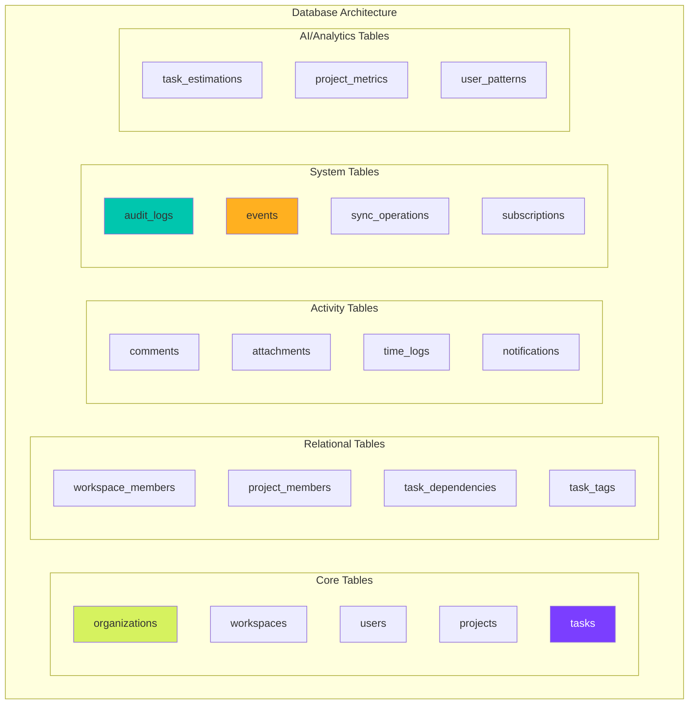

# PostgreSQL Database Schema Planning & Implementation

## Phase 1: Schema Architecture Planning

### 1.1 Database Design Principles



### 1.2 Table Categories

| Category | Purpose | Key Features |
|----------|---------|--------------|
| **Core Entities** | Primary business objects | UUID PKs, soft deletes, versioning |
| **Relationships** | Many-to-many mappings | Composite PKs, cascade rules |
| **Time-Series** | Historical data | Partitioning by date, retention policies |
| **Audit/Events** | Change tracking | Immutable, append-only, triggers |
| **Cache/Analytics** | Performance optimization | Materialized views, aggregates |
| **Sync/CRDT** | Offline support | Vector clocks, operation logs |

### 1.3 PostgreSQL v16 Features to Utilize

- **Partitioning**: For audit_logs, events, notifications (by created_at)
- **JSONB**: For custom_fields, metadata, preferences
- **Generated Columns**: For computed fields like is_overdue
- **Row-Level Security**: For multi-tenant data isolation
- **BRIN Indexes**: For time-series data
- **GiST/GIN Indexes**: For full-text search and JSONB
- **Parallel Query**: For analytics queries
- **Logical Replication**: For read replicas

---

## Phase 2: Complete Database Schema Implementation

```sql
-- =====================================================
-- LimeAura Database Schema
-- PostgreSQL v16
-- Version: 1.0.0
-- Generated: 2024-11-XX
-- =====================================================

-- =====================================================
-- EXTENSIONS
-- =====================================================

-- Enable required extensions
CREATE EXTENSION IF NOT EXISTS "uuid-ossp";      -- For UUID generation
CREATE EXTENSION IF NOT EXISTS "pgcrypto";       -- For encryption
CREATE EXTENSION IF NOT EXISTS "pg_trgm";        -- For fuzzy text search
CREATE EXTENSION IF NOT EXISTS "btree_gist";     -- For exclusion constraints
CREATE EXTENSION IF NOT EXISTS "postgres_fdw";   -- For foreign data wrapper
CREATE EXTENSION IF NOT EXISTS "pg_stat_statements"; -- For query performance

-- =====================================================
-- CUSTOM TYPES AND DOMAINS
-- =====================================================

-- Status enums
CREATE TYPE user_status AS ENUM ('active', 'inactive', 'suspended', 'deleted');
CREATE TYPE workspace_role AS ENUM ('owner', 'admin', 'member', 'guest', 'viewer');
CREATE TYPE project_status AS ENUM ('planning', 'active', 'on_hold', 'completed', 'archived', 'cancelled');
CREATE TYPE task_status AS ENUM ('backlog', 'todo', 'in_progress', 'in_review', 'done', 'cancelled');
CREATE TYPE task_priority AS ENUM ('critical', 'high', 'medium', 'low', 'none');
CREATE TYPE notification_type AS ENUM ('task_assigned', 'task_mentioned', 'task_completed', 'comment_added', 'status_changed', 'due_soon', 'overdue');
CREATE TYPE notification_channel AS ENUM ('in_app', 'email', 'push', 'slack', 'teams');
CREATE TYPE attachment_type AS ENUM ('image', 'document', 'video', 'audio', 'archive', 'other');
CREATE TYPE sync_state AS ENUM ('pending', 'syncing', 'synced', 'conflict', 'failed');
CREATE TYPE event_type AS ENUM ('created', 'updated', 'deleted', 'archived', 'restored', 'assigned', 'unassigned', 'commented', 'attached', 'tagged');
CREATE TYPE subscription_plan AS ENUM ('free', 'starter', 'professional', 'enterprise', 'custom');
CREATE TYPE integration_provider AS ENUM ('github', 'gitlab', 'slack', 'teams', 'google', 'jira', 'asana', 'trello', 'notion', 'linear');

-- Custom domains for validation
CREATE DOMAIN email AS TEXT CHECK (VALUE ~* '^[A-Za-z0-9._%+-]+@[A-Za-z0-9.-]+\.[A-Z|a-z]{2,}$');
CREATE DOMAIN url AS TEXT CHECK (VALUE ~* '^https?://.*');
CREATE DOMAIN color_hex AS TEXT CHECK (VALUE ~* '^#[0-9A-Fa-f]{6}$');
CREATE DOMAIN positive_integer AS INTEGER CHECK (VALUE > 0);
CREATE DOMAIN percentage AS NUMERIC(5,2) CHECK (VALUE >= 0 AND VALUE <= 100);

-- =====================================================
-- CORE TABLES
-- =====================================================

-- Organizations table
CREATE TABLE organizations (
    id UUID PRIMARY KEY DEFAULT uuid_generate_v4(),
    slug VARCHAR(255) UNIQUE NOT NULL,
    name VARCHAR(255) NOT NULL,
    description TEXT,
    website url,
    logo_url url,
    
    -- Subscription and limits
    subscription_plan subscription_plan DEFAULT 'free' NOT NULL,
    subscription_expires_at TIMESTAMPTZ,
    max_users INTEGER DEFAULT 10,
    max_projects INTEGER DEFAULT 5,
    max_storage_gb INTEGER DEFAULT 10,
    max_file_size_mb INTEGER DEFAULT 100,
    
    -- Settings
    settings JSONB DEFAULT '{}' NOT NULL,
    features JSONB DEFAULT '{}' NOT NULL,
    branding JSONB DEFAULT '{}' NOT NULL,
    
    -- Metadata
    created_at TIMESTAMPTZ DEFAULT CURRENT_TIMESTAMP NOT NULL,
    updated_at TIMESTAMPTZ DEFAULT CURRENT_TIMESTAMP NOT NULL,
    deleted_at TIMESTAMPTZ,
    
    CONSTRAINT org_slug_length CHECK (LENGTH(slug) >= 3)
);

-- Create indexes for organizations
CREATE INDEX idx_organizations_slug ON organizations(slug) WHERE deleted_at IS NULL;
CREATE INDEX idx_organizations_subscription ON organizations(subscription_plan, subscription_expires_at);
CREATE INDEX idx_organizations_deleted ON organizations(deleted_at);

-- Users table
CREATE TABLE users (
    id UUID PRIMARY KEY DEFAULT uuid_generate_v4(),
    email email UNIQUE NOT NULL,
    username VARCHAR(50) UNIQUE,
    full_name VARCHAR(255) NOT NULL,
    display_name VARCHAR(100),
    avatar_url url,
    
    -- Authentication
    password_hash VARCHAR(255),
    email_verified BOOLEAN DEFAULT FALSE,
    email_verification_token VARCHAR(255),
    password_reset_token VARCHAR(255),
    password_reset_expires TIMESTAMPTZ,
    
    -- Multi-factor auth
    mfa_enabled BOOLEAN DEFAULT FALSE,
    mfa_secret VARCHAR(255),
    mfa_backup_codes TEXT[],
    
    -- OAuth providers
    oauth_providers JSONB DEFAULT '[]' NOT NULL,
    
    -- Profile
    bio TEXT,
    location VARCHAR(255),
    timezone VARCHAR(50) DEFAULT 'UTC',
    locale VARCHAR(10) DEFAULT 'en',
    
    -- Preferences
    preferences JSONB DEFAULT '{}' NOT NULL,
    notification_settings JSONB DEFAULT '{}' NOT NULL,
    
    -- Status and activity
    status user_status DEFAULT 'active' NOT NULL,
    last_active_at TIMESTAMPTZ,
    last_login_at TIMESTAMPTZ,
    login_count INTEGER DEFAULT 0,
    
    -- Metadata
    created_at TIMESTAMPTZ DEFAULT CURRENT_TIMESTAMP NOT NULL,
    updated_at TIMESTAMPTZ DEFAULT CURRENT_TIMESTAMP NOT NULL,
    deleted_at TIMESTAMPTZ,
    
    CONSTRAINT username_format CHECK (username ~* '^[a-z0-9_-]{3,50}$')
);

-- Create indexes for users
CREATE INDEX idx_users_email ON users(email) WHERE deleted_at IS NULL;
CREATE INDEX idx_users_username ON users(username) WHERE deleted_at IS NULL;
CREATE INDEX idx_users_status ON users(status);
CREATE INDEX idx_users_last_active ON users(last_active_at DESC);
CREATE INDEX idx_users_oauth ON users USING GIN(oauth_providers);

-- Workspaces table
CREATE TABLE workspaces (
    id UUID PRIMARY KEY DEFAULT uuid_generate_v4(),
    organization_id UUID NOT NULL REFERENCES organizations(id) ON DELETE CASCADE,
    slug VARCHAR(255) NOT NULL,
    name VARCHAR(255) NOT NULL,
    description TEXT,
    icon VARCHAR(50),
    color color_hex,
    
    -- Settings
    is_private BOOLEAN DEFAULT FALSE,
    default_task_status task_status DEFAULT 'todo',
    settings JSONB DEFAULT '{}' NOT NULL,
    
    -- Metadata
    created_by UUID REFERENCES users(id),
    created_at TIMESTAMPTZ DEFAULT CURRENT_TIMESTAMP NOT NULL,
    updated_at TIMESTAMPTZ DEFAULT CURRENT_TIMESTAMP NOT NULL,
    archived_at TIMESTAMPTZ,
    deleted_at TIMESTAMPTZ,
    
    CONSTRAINT workspace_slug_unique UNIQUE (organization_id, slug),
    CONSTRAINT workspace_slug_format CHECK (slug ~* '^[a-z0-9-]{3,255}$')
);

-- Create indexes for workspaces
CREATE INDEX idx_workspaces_org ON workspaces(organization_id) WHERE deleted_at IS NULL;
CREATE INDEX idx_workspaces_slug ON workspaces(organization_id, slug) WHERE deleted_at IS NULL;
CREATE INDEX idx_workspaces_archived ON workspaces(archived_at);

-- Projects table
CREATE TABLE projects (
    id UUID PRIMARY KEY DEFAULT uuid_generate_v4(),
    workspace_id UUID NOT NULL REFERENCES workspaces(id) ON DELETE CASCADE,
    identifier VARCHAR(20) UNIQUE NOT NULL, -- e.g., "PROJ-123"
    name VARCHAR(255) NOT NULL,
    description TEXT,
    
    -- Visual
    icon VARCHAR(50),
    color color_hex,
    cover_image_url url,
    
    -- Status and dates
    status project_status DEFAULT 'planning' NOT NULL,
    start_date DATE,
    target_date DATE,
    actual_end_date DATE,
    
    -- Project details
    goals TEXT,
    success_metrics JSONB DEFAULT '[]',
    risks JSONB DEFAULT '[]',
    budget DECIMAL(15, 2),
    
    -- Settings
    is_private BOOLEAN DEFAULT FALSE,
    is_template BOOLEAN DEFAULT FALSE,
    settings JSONB DEFAULT '{}' NOT NULL,
    custom_fields JSONB DEFAULT '{}',
    
    -- Team
    owner_id UUID REFERENCES users(id),
    created_by UUID REFERENCES users(id),
    
    -- Metadata
    created_at TIMESTAMPTZ DEFAULT CURRENT_TIMESTAMP NOT NULL,
    updated_at TIMESTAMPTZ DEFAULT CURRENT_TIMESTAMP NOT NULL,
    archived_at TIMESTAMPTZ,
    deleted_at TIMESTAMPTZ,
    
    CONSTRAINT project_dates_valid CHECK (start_date <= target_date)
);

-- Create indexes for projects
CREATE INDEX idx_projects_workspace ON projects(workspace_id) WHERE deleted_at IS NULL;
CREATE INDEX idx_projects_identifier ON projects(identifier);
CREATE INDEX idx_projects_status ON projects(status) WHERE deleted_at IS NULL;
CREATE INDEX idx_projects_dates ON projects(start_date, target_date) WHERE deleted_at IS NULL;
CREATE INDEX idx_projects_owner ON projects(owner_id);
CREATE INDEX idx_projects_custom_fields ON projects USING GIN(custom_fields);

-- Tasks table (main entity)
CREATE TABLE tasks (
    id UUID PRIMARY KEY DEFAULT uuid_generate_v4(),
    project_id UUID NOT NULL REFERENCES projects(id) ON DELETE CASCADE,
    parent_id UUID REFERENCES tasks(id) ON DELETE CASCADE,
    
    -- Identifiers
    task_number SERIAL,
    identifier VARCHAR(50) UNIQUE NOT NULL, -- e.g., "PROJ-123-45"
    
    -- Core fields
    title VARCHAR(500) NOT NULL,
    description TEXT,
    status task_status DEFAULT 'todo' NOT NULL,
    priority task_priority DEFAULT 'medium' NOT NULL,
    
    -- Assignment
    assignee_id UUID REFERENCES users(id),
    reporter_id UUID REFERENCES users(id),
    
    -- Dates and time
    start_date TIMESTAMPTZ,
    due_date TIMESTAMPTZ,
    completed_at TIMESTAMPTZ,
    
    -- Estimation and tracking
    estimated_hours DECIMAL(8, 2),
    actual_hours DECIMAL(8, 2),
    remaining_hours DECIMAL(8, 2),
    story_points INTEGER,
    
    -- Progress and health
    progress percentage DEFAULT 0,
    is_blocked BOOLEAN DEFAULT FALSE,
    blocker_reason TEXT,
    health_status VARCHAR(20), -- 'on_track', 'at_risk', 'off_track'
    
    -- Metadata for sync
    version INTEGER DEFAULT 1 NOT NULL,
    client_id UUID,
    last_modified_by UUID REFERENCES users(id),
    
    -- Custom data
    custom_fields JSONB DEFAULT '{}',
    tags TEXT[] DEFAULT '{}',
    attachments_count INTEGER DEFAULT 0,
    comments_count INTEGER DEFAULT 0,
    
    -- Computed fields (using GENERATED columns in PG16)
    is_overdue BOOLEAN GENERATED ALWAYS AS (
        CASE 
            WHEN due_date IS NOT NULL AND status NOT IN ('done', 'cancelled') 
                AND due_date < CURRENT_TIMESTAMP 
            THEN true 
            ELSE false 
        END
    ) STORED,
    
    -- Timestamps
    created_at TIMESTAMPTZ DEFAULT CURRENT_TIMESTAMP NOT NULL,
    updated_at TIMESTAMPTZ DEFAULT CURRENT_TIMESTAMP NOT NULL,
    deleted_at TIMESTAMPTZ,
    
    CONSTRAINT task_dates_valid CHECK (start_date <= due_date),
    CONSTRAINT task_progress_valid CHECK (progress >= 0 AND progress <= 100),
    CONSTRAINT task_hours_positive CHECK (
        (estimated_hours IS NULL OR estimated_hours >= 0) AND
        (actual_hours IS NULL OR actual_hours >= 0) AND
        (remaining_hours IS NULL OR remaining_hours >= 0)
    )
);

-- Create indexes for tasks
CREATE INDEX idx_tasks_project ON tasks(project_id) WHERE deleted_at IS NULL;
CREATE INDEX idx_tasks_parent ON tasks(parent_id) WHERE deleted_at IS NULL;
CREATE INDEX idx_tasks_assignee ON tasks(assignee_id) WHERE deleted_at IS NULL;
CREATE INDEX idx_tasks_status ON tasks(status) WHERE deleted_at IS NULL;
CREATE INDEX idx_tasks_priority ON tasks(priority) WHERE deleted_at IS NULL;
CREATE INDEX idx_tasks_due_date ON tasks(due_date) WHERE deleted_at IS NULL;
CREATE INDEX idx_tasks_overdue ON tasks(is_overdue) WHERE is_overdue = true AND deleted_at IS NULL;
CREATE INDEX idx_tasks_identifier ON tasks(identifier);
CREATE INDEX idx_tasks_tags ON tasks USING GIN(tags);
CREATE INDEX idx_tasks_custom_fields ON tasks USING GIN(custom_fields);
CREATE INDEX idx_tasks_search ON tasks USING GIN(
    to_tsvector('english', COALESCE(title, '') || ' ' || COALESCE(description, ''))
);

-- =====================================================
-- RELATIONSHIP TABLES
-- =====================================================

-- Workspace members
CREATE TABLE workspace_members (
    workspace_id UUID NOT NULL REFERENCES workspaces(id) ON DELETE CASCADE,
    user_id UUID NOT NULL REFERENCES users(id) ON DELETE CASCADE,
    role workspace_role DEFAULT 'member' NOT NULL,
    
    -- Permissions override
    permissions JSONB DEFAULT '{}',
    
    -- Invitation
    invited_by UUID REFERENCES users(id),
    invited_at TIMESTAMPTZ,
    accepted_at TIMESTAMPTZ,
    
    -- Metadata
    joined_at TIMESTAMPTZ DEFAULT CURRENT_TIMESTAMP NOT NULL,
    last_accessed_at TIMESTAMPTZ,
    
    PRIMARY KEY (workspace_id, user_id)
);

CREATE INDEX idx_workspace_members_user ON workspace_members(user_id);
CREATE INDEX idx_workspace_members_role ON workspace_members(role);

-- Project members
CREATE TABLE project_members (
    project_id UUID NOT NULL REFERENCES projects(id) ON DELETE CASCADE,
    user_id UUID NOT NULL REFERENCES users(id) ON DELETE CASCADE,
    role VARCHAR(50) DEFAULT 'member' NOT NULL, -- 'lead', 'member', 'viewer'
    
    -- Capacity and allocation
    allocation_percentage percentage DEFAULT 100,
    capacity_hours_per_week DECIMAL(5, 2),
    
    -- Metadata
    added_by UUID REFERENCES users(id),
    added_at TIMESTAMPTZ DEFAULT CURRENT_TIMESTAMP NOT NULL,
    removed_at TIMESTAMPTZ,
    
    PRIMARY KEY (project_id, user_id)
);

CREATE INDEX idx_project_members_user ON project_members(user_id) WHERE removed_at IS NULL;
CREATE INDEX idx_project_members_role ON project_members(role);

-- Task dependencies
CREATE TABLE task_dependencies (
    id UUID PRIMARY KEY DEFAULT uuid_generate_v4(),
    task_id UUID NOT NULL REFERENCES tasks(id) ON DELETE CASCADE,
    depends_on_id UUID NOT NULL REFERENCES tasks(id) ON DELETE CASCADE,
    dependency_type VARCHAR(20) DEFAULT 'finish_to_start', -- 'finish_to_start', 'start_to_start', 'finish_to_finish'
    lag_days INTEGER DEFAULT 0,
    
    created_at TIMESTAMPTZ DEFAULT CURRENT_TIMESTAMP NOT NULL,
    
    CONSTRAINT no_self_dependency CHECK (task_id != depends_on_id),
    CONSTRAINT unique_dependency UNIQUE (task_id, depends_on_id)
);

CREATE INDEX idx_dependencies_task ON task_dependencies(task_id);
CREATE INDEX idx_dependencies_depends_on ON task_dependencies(depends_on_id);

-- Task watchers
CREATE TABLE task_watchers (
    task_id UUID NOT NULL REFERENCES tasks(id) ON DELETE CASCADE,
    user_id UUID NOT NULL REFERENCES users(id) ON DELETE CASCADE,
    
    -- Notification preferences for this watch
    notify_on_comment BOOLEAN DEFAULT TRUE,
    notify_on_status_change BOOLEAN DEFAULT TRUE,
    notify_on_assignment BOOLEAN DEFAULT TRUE,
    
    watched_at TIMESTAMPTZ DEFAULT CURRENT_TIMESTAMP NOT NULL,
    
    PRIMARY KEY (task_id, user_id)
);

CREATE INDEX idx_watchers_user ON task_watchers(user_id);

-- =====================================================
-- ACTIVITY TABLES
-- =====================================================

-- Comments
CREATE TABLE comments (
    id UUID PRIMARY KEY DEFAULT uuid_generate_v4(),
    task_id UUID NOT NULL REFERENCES tasks(id) ON DELETE CASCADE,
    parent_id UUID REFERENCES comments(id) ON DELETE CASCADE,
    
    -- Content
    content TEXT NOT NULL,
    content_html TEXT, -- Pre-rendered HTML for performance
    
    -- Author
    author_id UUID NOT NULL REFERENCES users(id),
    
    -- Mentions
    mentioned_users UUID[] DEFAULT '{}',
    
    -- Edit tracking
    edited_at TIMESTAMPTZ,
    edit_count INTEGER DEFAULT 0,
    
    -- Reactions
    reactions JSONB DEFAULT '{}', -- {"👍": ["user-id-1", "user-id-2"], "🎉": ["user-id-3"]}
    
    -- Metadata
    created_at TIMESTAMPTZ DEFAULT CURRENT_TIMESTAMP NOT NULL,
    updated_at TIMESTAMPTZ DEFAULT CURRENT_TIMESTAMP NOT NULL,
    deleted_at TIMESTAMPTZ
);

CREATE INDEX idx_comments_task ON comments(task_id) WHERE deleted_at IS NULL;
CREATE INDEX idx_comments_parent ON comments(parent_id) WHERE deleted_at IS NULL;
CREATE INDEX idx_comments_author ON comments(author_id);
CREATE INDEX idx_comments_mentioned ON comments USING GIN(mentioned_users);
CREATE INDEX idx_comments_created ON comments(created_at DESC);

-- Attachments
CREATE TABLE attachments (
    id UUID PRIMARY KEY DEFAULT uuid_generate_v4(),
    
    -- Polymorphic association
    entity_type VARCHAR(50) NOT NULL, -- 'task', 'comment', 'project'
    entity_id UUID NOT NULL,
    
    -- File details
    file_name VARCHAR(255) NOT NULL,
    file_size BIGINT NOT NULL, -- in bytes
    file_type attachment_type NOT NULL,
    mime_type VARCHAR(100),
    
    -- Storage
    storage_path TEXT NOT NULL,
    storage_provider VARCHAR(20) DEFAULT 's3', -- 's3', 'local', 'azure', 'gcs'
    cdn_url url,
    thumbnail_url url,
    
    -- Metadata
    uploaded_by UUID NOT NULL REFERENCES users(id),
    description TEXT,
    
    -- Virus scanning
    scanned_at TIMESTAMPTZ,
    scan_status VARCHAR(20), -- 'pending', 'clean', 'infected', 'error'
    
    -- Timestamps
    uploaded_at TIMESTAMPTZ DEFAULT CURRENT_TIMESTAMP NOT NULL,
    deleted_at TIMESTAMPTZ,
    
    CONSTRAINT file_size_limit CHECK (file_size <= 104857600) -- 100MB default
);

CREATE INDEX idx_attachments_entity ON attachments(entity_type, entity_id) WHERE deleted_at IS NULL;
CREATE INDEX idx_attachments_uploader ON attachments(uploaded_by);
CREATE INDEX idx_attachments_type ON attachments(file_type);

-- Time logs
CREATE TABLE time_logs (
    id UUID PRIMARY KEY DEFAULT uuid_generate_v4(),
    task_id UUID NOT NULL REFERENCES tasks(id) ON DELETE CASCADE,
    user_id UUID NOT NULL REFERENCES users(id),
    
    -- Time tracking
    started_at TIMESTAMPTZ NOT NULL,
    ended_at TIMESTAMPTZ,
    duration_minutes INTEGER GENERATED ALWAYS AS (
        CASE 
            WHEN ended_at IS NOT NULL 
            THEN EXTRACT(EPOCH FROM (ended_at - started_at)) / 60
            ELSE NULL
        END
    ) STORED,
    
    -- Details
    description TEXT,
    is_billable BOOLEAN DEFAULT TRUE,
    hourly_rate DECIMAL(10, 2),
    
    -- Metadata
    created_at TIMESTAMPTZ DEFAULT CURRENT_TIMESTAMP NOT NULL,
    updated_at TIMESTAMPTZ DEFAULT CURRENT_TIMESTAMP NOT NULL,
    deleted_at TIMESTAMPTZ,
    
    CONSTRAINT time_log_dates_valid CHECK (started_at <= ended_at)
);

CREATE INDEX idx_time_logs_task ON time_logs(task_id) WHERE deleted_at IS NULL;
CREATE INDEX idx_time_logs_user ON time_logs(user_id) WHERE deleted_at IS NULL;
CREATE INDEX idx_time_logs_date ON time_logs(started_at) WHERE deleted_at IS NULL;
CREATE INDEX idx_time_logs_billable ON time_logs(is_billable) WHERE deleted_at IS NULL;

-- =====================================================
-- NOTIFICATION SYSTEM
-- =====================================================

-- Notifications
CREATE TABLE notifications (
    id UUID PRIMARY KEY DEFAULT uuid_generate_v4(),
    recipient_id UUID NOT NULL REFERENCES users(id) ON DELETE CASCADE,
    
    -- Notification details
    type notification_type NOT NULL,
    title VARCHAR(255) NOT NULL,
    message TEXT,
    
    -- Related entities
    entity_type VARCHAR(50),
    entity_id UUID,
    actor_id UUID REFERENCES users(id),
    
    -- Delivery
    channels notification_channel[] DEFAULT '{in_app}',
    
    -- Status
    is_read BOOLEAN DEFAULT FALSE,
    read_at TIMESTAMPTZ,
    is_archived BOOLEAN DEFAULT FALSE,
    
    -- Action URL
    action_url TEXT,
    
    -- Metadata
    metadata JSONB DEFAULT '{}',
    created_at TIMESTAMPTZ DEFAULT CURRENT_TIMESTAMP NOT NULL,
    expires_at TIMESTAMPTZ,
    
    CONSTRAINT notification_expiry CHECK (expires_at IS NULL OR expires_at > created_at)
) PARTITION BY RANGE (created_at);

-- Create partitions for notifications (monthly)
CREATE TABLE notifications_2024_01 PARTITION OF notifications
    FOR VALUES FROM ('2024-01-01') TO ('2024-02-01');
CREATE TABLE notifications_2024_02 PARTITION OF notifications
    FOR VALUES FROM ('2024-02-01') TO ('2024-03-01');
-- Continue for other months...

CREATE INDEX idx_notifications_recipient ON notifications(recipient_id, is_read, created_at DESC);
CREATE INDEX idx_notifications_entity ON notifications(entity_type, entity_id);
CREATE INDEX idx_notifications_created ON notifications(created_at DESC);

-- =====================================================
-- SYNC AND COLLABORATION
-- =====================================================

-- Sync operations queue
CREATE TABLE sync_operations (
    id UUID PRIMARY KEY DEFAULT uuid_generate_v4(),
    client_id UUID NOT NULL,
    user_id UUID NOT NULL REFERENCES users(id),
    
    -- Operation details
    operation_type VARCHAR(20) NOT NULL, -- 'CREATE', 'UPDATE', 'DELETE'
    entity_type VARCHAR(50) NOT NULL,
    entity_id UUID NOT NULL,
    
    -- Version control
    client_version INTEGER NOT NULL,
    server_version INTEGER,
    
    -- Data
    operation_data JSONB NOT NULL,
    
    -- Sync state
    sync_state sync_state DEFAULT 'pending' NOT NULL,
    conflict_resolution JSONB,
    
    -- Timestamps
    created_at TIMESTAMPTZ DEFAULT CURRENT_TIMESTAMP NOT NULL,
    synced_at TIMESTAMPTZ,
    
    -- Ensure operations are processed in order
    sequence_number BIGSERIAL
);

CREATE INDEX idx_sync_ops_client ON sync_operations(client_id, sync_state);
CREATE INDEX idx_sync_ops_user ON sync_operations(user_id);
CREATE INDEX idx_sync_ops_entity ON sync_operations(entity_type, entity_id);
CREATE INDEX idx_sync_ops_sequence ON sync_operations(sequence_number);

-- Real-time subscriptions
CREATE TABLE subscriptions (
    id UUID PRIMARY KEY DEFAULT uuid_generate_v4(),
    user_id UUID NOT NULL REFERENCES users(id) ON DELETE CASCADE,
    connection_id VARCHAR(100) NOT NULL, -- WebSocket connection ID
    
    -- Subscription details
    channel VARCHAR(255) NOT NULL, -- e.g., 'project:uuid', 'workspace:uuid:tasks'
    filters JSONB DEFAULT '{}',
    
    -- Status
    is_active BOOLEAN DEFAULT TRUE,
    
    -- Metadata
    created_at TIMESTAMPTZ DEFAULT CURRENT_TIMESTAMP NOT NULL,
    last_ping_at TIMESTAMPTZ,
    
    CONSTRAINT unique_subscription UNIQUE (user_id, connection_id, channel)
);

CREATE INDEX idx_subscriptions_user ON subscriptions(user_id) WHERE is_active = TRUE;
CREATE INDEX idx_subscriptions_channel ON subscriptions(channel) WHERE is_active = TRUE;
CREATE INDEX idx_subscriptions_connection ON subscriptions(connection_id);

-- =====================================================
-- AUDIT AND EVENTS
-- =====================================================

-- Event store (append-only)
CREATE TABLE events (
    id UUID PRIMARY KEY DEFAULT uuid_generate_v4(),
    aggregate_id UUID NOT NULL, -- The entity being modified
    aggregate_type VARCHAR(50) NOT NULL, -- 'task', 'project', etc.
    
    -- Event details
    event_type event_type NOT NULL,
    event_version INTEGER NOT NULL DEFAULT 1,
    event_data JSONB NOT NULL,
    
    -- Actor
    user_id UUID REFERENCES users(id),
    
    -- Context
    workspace_id UUID REFERENCES workspaces(id),
    project_id UUID REFERENCES projects(id),
    
    -- Request metadata
    ip_address INET,
    user_agent TEXT,
    session_id UUID,
    
    -- Timestamp
    occurred_at TIMESTAMPTZ DEFAULT CURRENT_TIMESTAMP NOT NULL
) PARTITION BY RANGE (occurred_at);

-- Create partitions for events (monthly)
CREATE TABLE events_2024_01 PARTITION OF events
    FOR VALUES FROM ('2024-01-01') TO ('2024-02-01');
-- Continue for other months...

CREATE INDEX idx_events_aggregate ON events(aggregate_type, aggregate_id, occurred_at DESC);
CREATE INDEX idx_events_user ON events(user_id, occurred_at DESC);
CREATE INDEX idx_events_workspace ON events(workspace_id, occurred_at DESC);
CREATE INDEX idx_events_occurred ON events USING BRIN(occurred_at);

-- Audit logs (for compliance)
CREATE TABLE audit_logs (
    id UUID PRIMARY KEY DEFAULT uuid_generate_v4(),
    
    -- What happened
    action VARCHAR(100) NOT NULL,
    entity_type VARCHAR(50) NOT NULL,
    entity_id UUID,
    
    -- Who did it
    user_id UUID REFERENCES users(id),
    
    -- Changes
    old_values JSONB,
    new_values JSONB,
    
    -- Context
    organization_id UUID REFERENCES organizations(id),
    workspace_id UUID REFERENCES workspaces(id),
    
    -- Request details
    ip_address INET,
    user_agent TEXT,
    request_id UUID,
    
    -- Timestamp
    created_at TIMESTAMPTZ DEFAULT CURRENT_TIMESTAMP NOT NULL
) PARTITION BY RANGE (created_at);

-- Create partitions for audit logs
CREATE TABLE audit_logs_2024_01 PARTITION OF audit_logs
    FOR VALUES FROM ('2024-01-01') TO ('2024-02-01');
-- Continue for other months...

CREATE INDEX idx_audit_entity ON audit_logs(entity_type, entity_id, created_at DESC);
CREATE INDEX idx_audit_user ON audit_logs(user_id, created_at DESC);
CREATE INDEX idx_audit_org ON audit_logs(organization_id, created_at DESC);
CREATE INDEX idx_audit_created ON audit_logs USING BRIN(created_at);

-- =====================================================
-- AI AND ANALYTICS
-- =====================================================

-- Task estimations
CREATE TABLE task_estimations (
    id UUID PRIMARY KEY DEFAULT uuid_generate_v4(),
    task_id UUID NOT NULL REFERENCES tasks(id) ON DELETE CASCADE,
    
    -- AI predictions
    estimated_hours DECIMAL(8, 2),
    confidence_score percentage,
    
    -- Factors considered
    similar_tasks UUID[],
    factors JSONB, -- {"complexity": 0.7, "team_velocity": 0.8, "dependencies": 0.5}
    
    -- Model info
    model_version VARCHAR(20),
    
    -- Metadata
    created_at TIMESTAMPTZ DEFAULT CURRENT_TIMESTAMP NOT NULL,
    created_by VARCHAR(20) DEFAULT 'ai' -- 'ai', 'user'
);

CREATE INDEX idx_estimations_task ON task_estimations(task_id);
CREATE INDEX idx_estimations_created ON task_estimations(created_at DESC);

-- User activity patterns
CREATE TABLE user_patterns (
    id UUID PRIMARY KEY DEFAULT uuid_generate_v4(),
    user_id UUID NOT NULL REFERENCES users(id) ON DELETE CASCADE,
    
    -- Activity patterns
    peak_hours INTEGER[], -- [9, 10, 11, 14, 15, 16]
    peak_days INTEGER[], -- [1, 2, 3, 4, 5] (Mon-Fri)
    average_session_minutes INTEGER,
    
    -- Productivity metrics
    tasks_completed_daily_avg DECIMAL(5, 2),
    tasks_created_daily_avg DECIMAL(5, 2),
    collaboration_score percentage,
    
    -- Preferences learned
    preferred_view VARCHAR(20), -- 'kanban', 'list', 'gantt'
    common_filters JSONB,
    frequently_accessed_projects UUID[],
    
    -- Period
    calculated_for_date DATE NOT NULL,
    
    CONSTRAINT unique_user_pattern_date UNIQUE (user_id, calculated_for_date)
);

CREATE INDEX idx_patterns_user ON user_patterns(user_id, calculated_for_date DESC);

-- Project metrics (materialized view for performance)
CREATE MATERIALIZED VIEW project_metrics AS
SELECT 
    p.id as project_id,
    p.workspace_id,
    COUNT(DISTINCT t.id) as total_tasks,
    COUNT(DISTINCT t.id) FILTER (WHERE t.status = 'done') as completed_tasks,
    COUNT(DISTINCT t.id) FILTER (WHERE t.is_overdue = true) as overdue_tasks,
    COUNT(DISTINCT t.assignee_id) as team_members,
    AVG(t.actual_hours) as avg_task_hours,
    SUM(t.actual_hours) as total_hours_logged,
    
    -- Calculate velocity
    COUNT(DISTINCT t.id) FILTER (
        WHERE t.status = 'done' 
        AND t.completed_at >= CURRENT_DATE - INTERVAL '30 days'
    ) as tasks_completed_30d,
    
    -- Health score calculation
    CASE 
        WHEN COUNT(t.id) = 0 THEN 100
        ELSE GREATEST(0, 
            100 - (
                COUNT(t.id) FILTER (WHERE t.is_overdue = true) * 10 +
                COUNT(t.id) FILTER (WHERE t.is_blocked = true) * 5
            )
        )
    END as health_score,
    
    -- Dates
    MIN(t.created_at) as first_task_created,
    MAX(t.updated_at) as last_activity,
    NOW() as calculated_at
FROM projects p
LEFT JOIN tasks t ON t.project_id = p.id AND t.deleted_at IS NULL
WHERE p.deleted_at IS NULL
GROUP BY p.id, p.workspace_id;

CREATE UNIQUE INDEX idx_project_metrics_project ON project_metrics(project_id);
CREATE INDEX idx_project_metrics_workspace ON project_metrics(workspace_id);
CREATE INDEX idx_project_metrics_health ON project_metrics(health_score);

-- =====================================================
-- INTEGRATIONS
-- =====================================================

-- External integrations
CREATE TABLE integrations (
    id UUID PRIMARY KEY DEFAULT uuid_generate_v4(),
    workspace_id UUID NOT NULL REFERENCES workspaces(id) ON DELETE CASCADE,
    
    -- Provider details
    provider integration_provider NOT NULL,
    provider_account_id VARCHAR(255),
    
    -- Authentication
    access_token TEXT,
    refresh_token TEXT,
    token_expires_at TIMESTAMPTZ,
    
    -- Configuration
    config JSONB DEFAULT '{}' NOT NULL,
    webhook_url url,
    webhook_secret VARCHAR(255),
    
    -- Status
    is_active BOOLEAN DEFAULT TRUE,
    last_sync_at TIMESTAMPTZ,
    sync_status VARCHAR(20),
    
    -- Metadata
    created_by UUID REFERENCES users(id),
    created_at TIMESTAMPTZ DEFAULT CURRENT_TIMESTAMP NOT NULL,
    updated_at TIMESTAMPTZ DEFAULT CURRENT_TIMESTAMP NOT NULL,
    
    CONSTRAINT unique_workspace_provider UNIQUE (workspace_id, provider)
);

CREATE INDEX idx_integrations_workspace ON integrations(workspace_id) WHERE is_active = TRUE;
CREATE INDEX idx_integrations_provider ON integrations(provider);

-- Integration mappings (e.g., GitHub issue -> Task)
CREATE TABLE integration_mappings (
    id UUID PRIMARY KEY DEFAULT uuid_generate_v4(),
    integration_id UUID NOT NULL REFERENCES integrations(id) ON DELETE CASCADE,
    
    -- External reference
    external_id VARCHAR(255) NOT NULL,
    external_type VARCHAR(50), -- 'issue', 'pr', 'card', etc.
    
    -- Internal reference
    internal_id UUID NOT NULL,
    internal_type VARCHAR(50) NOT NULL, -- 'task', 'project', etc.
    
    -- Sync metadata
    last_synced_at TIMESTAMPTZ,
    sync_hash VARCHAR(64), -- For change detection
    
    created_at TIMESTAMPTZ DEFAULT CURRENT_TIMESTAMP NOT NULL,
    
    CONSTRAINT unique_mapping UNIQUE (integration_id, external_id)
);

CREATE INDEX idx_mappings_integration ON integration_mappings(integration_id);
CREATE INDEX idx_mappings_internal ON integration_mappings(internal_type, internal_id);

-- =====================================================
-- FUNCTIONS AND TRIGGERS
-- =====================================================

-- Function to update updated_at timestamp
CREATE OR REPLACE FUNCTION update_updated_at()
RETURNS TRIGGER AS $$
BEGIN
    NEW.updated_at = CURRENT_TIMESTAMP;
    RETURN NEW;
END;
$$ LANGUAGE plpgsql;

-- Apply updated_at trigger to all relevant tables
CREATE TRIGGER update_organizations_updated_at BEFORE UPDATE ON organizations
    FOR EACH ROW EXECUTE FUNCTION update_updated_at();
CREATE TRIGGER update_users_updated_at BEFORE UPDATE ON users
    FOR EACH ROW EXECUTE FUNCTION update_updated_at();
CREATE TRIGGER update_workspaces_updated_at BEFORE UPDATE ON workspaces
    FOR EACH ROW EXECUTE FUNCTION update_updated_at();
CREATE TRIGGER update_projects_updated_at BEFORE UPDATE ON projects
    FOR EACH ROW EXECUTE FUNCTION update_updated_at();
CREATE TRIGGER update_tasks_updated_at BEFORE UPDATE ON tasks
    FOR EACH ROW EXECUTE FUNCTION update_updated_at();
CREATE TRIGGER update_comments_updated_at BEFORE UPDATE ON comments
    FOR EACH ROW EXECUTE FUNCTION update_updated_at();
CREATE TRIGGER update_time_logs_updated_at BEFORE UPDATE ON time_logs
    FOR EACH ROW EXECUTE FUNCTION update_updated_at();

-- Function to increment task version on update (for optimistic locking)
CREATE OR REPLACE FUNCTION increment_task_version()
RETURNS TRIGGER AS $$
BEGIN
    NEW.version = OLD.version + 1;
    RETURN NEW;
END;
$$ LANGUAGE plpgsql;

CREATE TRIGGER increment_task_version_trigger BEFORE UPDATE ON tasks
    FOR EACH ROW EXECUTE FUNCTION increment_task_version();

-- Function to update task counts
CREATE OR REPLACE FUNCTION update_task_counts()
RETURNS TRIGGER AS $$
BEGIN
    IF TG_OP = 'INSERT' THEN
        -- Update comments count if it's a comment
        IF TG_TABLE_NAME = 'comments' THEN
            UPDATE tasks SET comments_count = comments_count + 1 
            WHERE id = NEW.task_id;
        END IF;
        -- Update attachments count if it's an attachment
        IF TG_TABLE_NAME = 'attachments' AND NEW.entity_type = 'task' THEN
            UPDATE tasks SET attachments_count = attachments_count + 1 
            WHERE id = NEW.entity_id;
        END IF;
    ELSIF TG_OP = 'DELETE' THEN
        IF TG_TABLE_NAME = 'comments' THEN
            UPDATE tasks SET comments_count = GREATEST(0, comments_count - 1) 
            WHERE id = OLD.task_id;
        END IF;
        IF TG_TABLE_NAME = 'attachments' AND OLD.entity_type = 'task' THEN
            UPDATE tasks SET attachments_count = GREATEST(0, attachments_count - 1) 
            WHERE id = OLD.entity_id;
        END IF;
    END IF;
    RETURN NULL;
END;
$$ LANGUAGE plpgsql;

CREATE TRIGGER update_task_comment_count AFTER INSERT OR DELETE ON comments
    FOR EACH ROW EXECUTE FUNCTION update_task_counts();
CREATE TRIGGER update_task_attachment_count AFTER INSERT OR DELETE ON attachments
    FOR EACH ROW EXECUTE FUNCTION update_task_counts();

-- Function to create audit log entry
CREATE OR REPLACE FUNCTION create_audit_log()
RETURNS TRIGGER AS $$
DECLARE
    v_user_id UUID;
    v_old_values JSONB;
    v_new_values JSONB;
    v_action VARCHAR(100);
BEGIN
    -- Get user_id from context (set by application)
    v_user_id := current_setting('app.current_user_id', true)::UUID;
    
    -- Determine action
    v_action := TG_OP || '_' || TG_TABLE_NAME;
    
    -- Prepare old and new values
    IF TG_OP = 'DELETE' THEN
        v_old_values := to_jsonb(OLD);
        v_new_values := NULL;
    ELSIF TG_OP = 'INSERT' THEN
        v_old_values := NULL;
        v_new_values := to_jsonb(NEW);
    ELSE -- UPDATE
        v_old_values := to_jsonb(OLD);
        v_new_values := to_jsonb(NEW);
    END IF;
    
    -- Insert audit log
    INSERT INTO audit_logs (
        action, entity_type, entity_id, user_id,
        old_values, new_values,
        ip_address, user_agent, request_id
    ) VALUES (
        v_action, 
        TG_TABLE_NAME,
        COALESCE(NEW.id, OLD.id),
        v_user_id,
        v_old_values,
        v_new_values,
        inet(current_setting('app.client_ip', true)),
        current_setting('app.user_agent', true),
        current_setting('app.request_id', true)::UUID
    );
    
    RETURN NEW;
END;
$$ LANGUAGE plpgsql;

-- Apply audit triggers to critical tables
CREATE TRIGGER audit_tasks AFTER INSERT OR UPDATE OR DELETE ON tasks
    FOR EACH ROW EXECUTE FUNCTION create_audit_log();
CREATE TRIGGER audit_projects AFTER INSERT OR UPDATE OR DELETE ON projects
    FOR EACH ROW EXECUTE FUNCTION create_audit_log();

-- Function to calculate project progress
CREATE OR REPLACE FUNCTION calculate_project_progress(p_project_id UUID)
RETURNS DECIMAL AS $$
DECLARE
    v_total_tasks INTEGER;
    v_completed_tasks INTEGER;
    v_progress DECIMAL;
BEGIN
    SELECT 
        COUNT(*),
        COUNT(*) FILTER (WHERE status = 'done')
    INTO v_total_tasks, v_completed_tasks
    FROM tasks
    WHERE project_id = p_project_id
    AND deleted_at IS NULL;
    
    IF v_total_tasks = 0 THEN
        RETURN 0;
    ELSE
        RETURN ROUND((v_completed_tasks::DECIMAL / v_total_tasks) * 100, 2);
    END IF;
END;
$$ LANGUAGE plpgsql;

-- Function to get task dependencies recursively
CREATE OR REPLACE FUNCTION get_task_dependencies(p_task_id UUID)
RETURNS TABLE(task_id UUID, level INTEGER) AS $$
WITH RECURSIVE dep_tree AS (
    -- Base case: direct dependencies
    SELECT 
        td.depends_on_id as task_id,
        1 as level
    FROM task_dependencies td
    WHERE td.task_id = p_task_id
    
    UNION ALL
    
    -- Recursive case: dependencies of dependencies
    SELECT 
        td.depends_on_id as task_id,
        dt.level + 1
    FROM task_dependencies td
    JOIN dep_tree dt ON dt.task_id = td.task_id
    WHERE dt.level < 10 -- Prevent infinite recursion
)
SELECT * FROM dep_tree;
$$ LANGUAGE SQL;

-- =====================================================
-- INDEXES FOR PERFORMANCE
-- =====================================================

-- Full-text search indexes
CREATE INDEX idx_tasks_fulltext ON tasks 
    USING GIN(to_tsvector('english', title || ' ' || COALESCE(description, '')));
CREATE INDEX idx_projects_fulltext ON projects 
    USING GIN(to_tsvector('english', name || ' ' || COALESCE(description, '')));
CREATE INDEX idx_comments_fulltext ON comments 
    USING GIN(to_tsvector('english', content));

-- Composite indexes for common queries
CREATE INDEX idx_tasks_project_status ON tasks(project_id, status) WHERE deleted_at IS NULL;
CREATE INDEX idx_tasks_assignee_status ON tasks(assignee_id, status) WHERE deleted_at IS NULL;
CREATE INDEX idx_tasks_due_status ON tasks(due_date, status) WHERE deleted_at IS NULL AND due_date IS NOT NULL;

-- =====================================================
-- ROW LEVEL SECURITY
-- =====================================================

-- Enable RLS on sensitive tables
ALTER TABLE tasks ENABLE ROW LEVEL SECURITY;
ALTER TABLE projects ENABLE ROW LEVEL SECURITY;
ALTER TABLE comments ENABLE ROW LEVEL SECURITY;

-- Policy: Users can only see tasks in their workspaces
CREATE POLICY workspace_tasks_policy ON tasks
    FOR ALL
    USING (
        project_id IN (
            SELECT p.id FROM projects p
            JOIN workspace_members wm ON wm.workspace_id = p.workspace_id
            WHERE wm.user_id = current_setting('app.current_user_id', true)::UUID
        )
    );

-- Policy: Users can only see projects in their workspaces
CREATE POLICY workspace_projects_policy ON projects
    FOR ALL
    USING (
        workspace_id IN (
            SELECT workspace_id FROM workspace_members
            WHERE user_id = current_setting('app.current_user_id', true)::UUID
        )
    );

-- =====================================================
-- INITIAL DATA
-- =====================================================

-- Insert default organization for development
INSERT INTO organizations (id, slug, name, description, subscription_plan)
VALUES (
    'f47ac10b-58cc-4372-a567-0e02b2c3d479',
    'demo-org',
    'Demo Organization',
    'Default organization for development',
    'enterprise'
) ON CONFLICT (id) DO NOTHING;

-- Insert demo users
INSERT INTO users (id, email, username, full_name, display_name, status)
VALUES 
    ('550e8400-e29b-41d4-a716-446655440001', 'admin@limeaura.com', 'admin', 'Admin User', 'Admin', 'active'),
    ('550e8400-e29b-41d4-a716-446655440002', 'sarah@limeaura.com', 'sarah', 'Sarah Chen', 'Sarah', 'active'),
    ('550e8400-e29b-41d4-a716-446655440003', 'alex@limeaura.com', 'alex', 'Alex Rodriguez', 'Alex', 'active')
ON CONFLICT (id) DO NOTHING;

-- Insert demo workspace
INSERT INTO workspaces (id, organization_id, slug, name, description)
VALUES (
    '123e4567-e89b-12d3-a456-426614174001',
    'f47ac10b-58cc-4372-a567-0e02b2c3d479',
    'engineering',
    'Engineering',
    'Engineering team workspace'
) ON CONFLICT (id) DO NOTHING;

-- Add users to workspace
INSERT INTO workspace_members (workspace_id, user_id, role)
VALUES 
    ('123e4567-e89b-12d3-a456-426614174001', '550e8400-e29b-41d4-a716-446655440001', 'owner'),
    ('123e4567-e89b-12d3-a456-426614174001', '550e8400-e29b-41d4-a716-446655440002', 'admin'),
    ('123e4567-e89b-12d3-a456-426614174001', '550e8400-e29b-41d4-a716-446655440003', 'member')
ON CONFLICT DO NOTHING;

-- =====================================================
-- MAINTENANCE AND OPTIMIZATION
-- =====================================================

-- Analyze tables for query planner
ANALYZE;

-- Create statistics for multi-column queries
CREATE STATISTICS tasks_project_assignee ON project_id, assignee_id FROM tasks;
CREATE STATISTICS tasks_status_priority ON status, priority FROM tasks;

-- Refresh materialized view
REFRESH MATERIALIZED VIEW project_metrics;

-- Grant permissions (adjust for your environment)
GRANT ALL PRIVILEGES ON ALL TABLES IN SCHEMA public TO limeaura_app;
GRANT ALL PRIVILEGES ON ALL SEQUENCES IN SCHEMA public TO limeaura_app;
GRANT EXECUTE ON ALL FUNCTIONS IN SCHEMA public TO limeaura_app;

-- =====================================================
-- MONITORING QUERIES
-- =====================================================

-- View to monitor table sizes
CREATE OR REPLACE VIEW table_sizes AS
SELECT
    schemaname AS schema,
    tablename AS table,
    pg_size_pretty(pg_total_relation_size(schemaname||'.'||tablename)) AS size,
    pg_total_relation_size(schemaname||'.'||tablename) AS size_bytes
FROM pg_tables
WHERE schemaname = 'public'
ORDER BY size_bytes DESC;

-- View to monitor index usage
CREATE OR REPLACE VIEW index_usage AS
SELECT
    schemaname,
    tablename,
    indexname,
    idx_scan,
    idx_tup_read,
    idx_tup_fetch,
    pg_size_pretty(pg_relation_size(indexrelid)) AS index_size
FROM pg_stat_user_indexes
ORDER BY idx_scan DESC;

-- View to identify slow queries
CREATE OR REPLACE VIEW slow_queries AS
SELECT
    substring(query, 1, 100) AS query_preview,
    calls,
    total_exec_time,
    mean_exec_time,
    max_exec_time,
    stddev_exec_time
FROM pg_stat_statements
WHERE mean_exec_time > 100 -- queries taking more than 100ms
ORDER BY mean_exec_time DESC
LIMIT 20;

-- =====================================================
-- DATABASE CONFIGURATION COMMENTS
-- =====================================================

COMMENT ON DATABASE limeaura IS 'LimeAura Productivity Suite Database';
COMMENT ON SCHEMA public IS 'Main application schema';
COMMENT ON TABLE tasks IS 'Core task entity with CRDT support for offline sync';
COMMENT ON TABLE sync_operations IS 'Queue for offline-first synchronization';
COMMENT ON TABLE events IS 'Event sourcing store for audit and replay';
COMMENT ON COLUMN tasks.version IS 'Optimistic locking version, incremented on each update';
COMMENT ON COLUMN tasks.is_overdue IS 'Generated column, automatically computed based on due_date and status';

-- =====================================================
-- END OF SCHEMA
-- =====================================================

-- Display summary
DO $$
DECLARE
    v_tables INTEGER;
    v_indexes INTEGER;
    v_functions INTEGER;
BEGIN
    SELECT COUNT(*) INTO v_tables FROM pg_tables WHERE schemaname = 'public';
    SELECT COUNT(*) INTO v_indexes FROM pg_indexes WHERE schemaname = 'public';
    SELECT COUNT(*) INTO v_functions FROM pg_proc p
        JOIN pg_namespace n ON p.pronamespace = n.oid
        WHERE n.nspname = 'public';
    
    RAISE NOTICE 'LimeAura Database Schema Created Successfully!';
    RAISE NOTICE 'Tables: %, Indexes: %, Functions: %', v_tables, v_indexes, v_functions;
    RAISE NOTICE 'Run "SELECT * FROM table_sizes;" to view table information';
END $$;
```

---

## Post-Installation Scripts

### Optimization Script (`optimize.sql`)

```sql
-- Run after initial data load for optimal performance

-- Update table statistics
VACUUM ANALYZE;

-- Create additional indexes based on usage patterns
CREATE INDEX CONCURRENTLY IF NOT EXISTS idx_tasks_text_search 
    ON tasks USING GIN (
        to_tsvector('english', 
            title || ' ' || 
            COALESCE(description, '') || ' ' || 
            COALESCE(array_to_string(tags, ' '), '')
        )
    );

-- Set up automated maintenance
CREATE EXTENSION IF NOT EXISTS pg_cron;

-- Schedule daily vacuum
SELECT cron.schedule('daily-vacuum', '0 2 * * *', 'VACUUM ANALYZE;');

-- Schedule hourly materialized view refresh
SELECT cron.schedule('refresh-metrics', '0 * * * *', 'REFRESH MATERIALIZED VIEW CONCURRENTLY project_metrics;');

-- Schedule partition creation for next month
CREATE OR REPLACE FUNCTION create_monthly_partitions()
RETURNS void AS $$
DECLARE
    start_date date;
    end_date date;
    partition_name text;
BEGIN
    start_date := date_trunc('month', CURRENT_DATE + interval '1 month');
    end_date := start_date + interval '1 month';
    
    -- Create partitions for notifications
    partition_name := 'notifications_' || to_char(start_date, 'YYYY_MM');
    EXECUTE format('CREATE TABLE IF NOT EXISTS %I PARTITION OF notifications FOR VALUES FROM (%L) TO (%L)',
        partition_name, start_date, end_date);
    
    -- Create partitions for events
    partition_name := 'events_' || to_char(start_date, 'YYYY_MM');
    EXECUTE format('CREATE TABLE IF NOT EXISTS %I PARTITION OF events FOR VALUES FROM (%L) TO (%L)',
        partition_name, start_date, end_date);
    
    -- Create partitions for audit_logs
    partition_name := 'audit_logs_' || to_char(start_date, 'YYYY_MM');
    EXECUTE format('CREATE TABLE IF NOT EXISTS %I PARTITION OF audit_logs FOR VALUES FROM (%L) TO (%L)',
        partition_name, start_date, end_date);
END;
$$ LANGUAGE plpgsql;

SELECT cron.schedule('create-partitions', '0 0 25 * *', 'SELECT create_monthly_partitions();');
```

### Development Seed Data (`seed.sql`)

```sql
-- Additional seed data for development

-- Create sample project
INSERT INTO projects (id, workspace_id, identifier, name, description, status, start_date, target_date)
VALUES (
    '987e6543-e21b-12d3-a456-426614174001',
    '123e4567-e89b-12d3-a456-426614174001',
    'LIME-2024',
    'LimeAura Platform Development',
    'Building the next generation productivity suite',
    'active',
    '2024-01-01',
    '2024-12-31'
);

-- Create sample tasks
INSERT INTO tasks (project_id, identifier, title, description, status, priority, assignee_id, reporter_id, due_date)
VALUES 
    ('987e6543-e21b-12d3-a456-426614174001', 'LIME-2024-1', 'Setup development environment', 'Configure local dev setup with Docker', 'done', 'high', '550e8400-e29b-41d4-a716-446655440003', '550e8400-e29b-41d4-a716-446655440001', '2024-01-15'),
    ('987e6543-e21b-12d3-a456-426614174001', 'LIME-2024-2', 'Implement authentication system', 'JWT-based auth with refresh tokens', 'in_progress', 'critical', '550e8400-e29b-41d4-a716-446655440003', '550e8400-e29b-41d4-a716-446655440002', '2024-02-01'),
    ('987e6543-e21b-12d3-a456-426614174001', 'LIME-2024-3', 'Design database schema', 'PostgreSQL schema with JSONB for flexibility', 'done', 'high', '550e8400-e29b-41d4-a716-446655440002', '550e8400-e29b-41d4-a716-446655440001', '2024-01-20'),
    ('987e6543-e21b-12d3-a456-426614174001', 'LIME-2024-4', 'Create REST API endpoints', 'RESTful API with OpenAPI documentation', 'todo', 'medium', NULL, '550e8400-e29b-41d4-a716-446655440002', '2024-02-15'),
    ('987e6543-e21b-12d3-a456-426614174001', 'LIME-2024-5', 'Implement WebSocket server', 'Real-time updates using Socket.io', 'todo', 'high', NULL, '550e8400-e29b-41d4-a716-446655440003', '2024-03-01');

-- Refresh materialized view
REFRESH MATERIALIZED VIEW project_metrics;
```

---

## Schema Documentation

### Key Design Decisions

1. **UUID Primary Keys**: All tables use UUIDs for distributed system compatibility and offline-first architecture
2. **Soft Deletes**: `deleted_at` columns enable data recovery and audit trails
3. **Version Control**: Tasks include version numbers for optimistic locking in concurrent editing
4. **JSONB Fields**: Flexible schema for custom fields, preferences, and metadata
5. **Partitioning**: Time-series tables (events, audit_logs, notifications) use range partitioning for performance
6. **Generated Columns**: Computed fields like `is_overdue` use PostgreSQL 16's GENERATED columns
7. **Row-Level Security**: Multi-tenant data isolation at the database level
8. **Event Sourcing**: Complete audit trail in the events table for replay and debugging

### Performance Considerations

- **Indexes**: Strategic indexes on foreign keys, search fields, and common query patterns
- **Materialized Views**: Pre-computed metrics for dashboard performance
- **BRIN Indexes**: Space-efficient indexes for time-series data
- **GIN Indexes**: Full-text search and JSONB queries
- **Table Partitioning**: Monthly partitions for large tables to maintain query performance

### Security Features

- **Row-Level Security**: Enforces data access at the database level
- **Audit Logging**: Complete audit trail with trigger-based logging
- **Encryption Support**: pgcrypto extension for field-level encryption
- **Input Validation**: Domain types and CHECK constraints for data integrity

This comprehensive schema provides a solid foundation for the LimeAura productivity suite, supporting all planned features including offline-first architecture, real-time collaboration, AI predictions, and enterprise-grade security.
